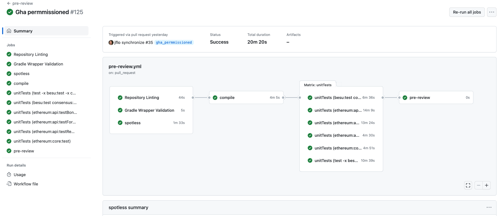

# CI/CD Migration

> [!NOTE]
> This is a historical design document covering the migration from CircleCI to GitHub Actions. Some links point to personal forks used during the migration work.

Moving from CircleCI to GitHub Actions (GHA).

## GHA Impressions

Porting over the functionality from CircleCI was tedious, but fairly straightforward. The design of small components combined with access to the runners via self-hosting (seldom necessary) made the development process pretty accessible. Being able to tie into the GitHub event stream allows for improved and [simplified release processes that can be adopted incrementally](https://github.com/besu-eth/besu/pull/4791).

Secrets management was simple and straightforward. Secrets are defined in the repo settings, and are injected for use by the action definition. Logging output was properly obfuscated whenever a secret was used.

Minimal changes were required to Gradle-based build tasks, though the delegation to gradle for publishing and tagging complicates things. Suggest removing those concerns from gradle. It makes sense for gradle to know how to produce artifacts like tarballs and docker images, but release-related metadata should be managed externally.

The use of self-hosted runners should likely be avoided due to cost and [security concerns](https://johnstawinski.com/2024/01/11/playing-with-fire-how-we-executed-a-critical-supply-chain-attack-on-pytorch/).

## Challenges

**File Permissions:** File ownership and permissions get pretty convoluted when using any docker-based action. Since they have no notion of the UID to run as, their output ends up being owned by root. [This action](https://github.com/marketplace/actions/reset-workspace-ownership-action) was used to work around the problem, and it can be avoided altogether by using GitHub-hosted runners instead of self-hosted ones.

**Test Splitting:** A large portion of the time spent was to re-implement test splitting so many hosts can all run the tests in parallel. This is a feature supported by CircleCI, but the only GHA support for this function to be found is [still in alpha](https://github.com/marketplace/actions/split-tests). We are currently only dividing the number of tests evenly across runners, however there is another means of test splitting that warrants investigation: one based on the test timings available via a previous run's junit results.

**Cost:** While an in-depth cost analysis has not been done yet, we suspect it will be nearly free. The full CI/CD pipeline was runnable on free-tier GitHub-hosted runners.

## Planned CI/CD Design

Subdivide the CI process into reusable phases, and defer long-running and expensive phases until as late and infrequently as possible, while still ensuring maximum potential quality checks.

On new PR open, draft or otherwise, the following actions would happen:

- Check for repo compliance via repolinter.
- Check for source code formatting via spotless.
- Check gradle tooling validation.
- Compile all code.
  - Then validate javadocs - this depends on bytecode output.
- Run unitTests.
  - Any test failures will be annotated on the PR.
  - Tests will be sharded to run in parallel.

This is referred to as the pre-review workflow, but overall it looks like this:

It takes about 20 minutes, end to end, but if we can be smarter about splitting the unit tests we could easily cut that in half.

Once the PR is approved, the following can be run in parallel:

- Run integrationTests.
- Run acceptanceTests.
- Run referenceTests.

Test results can then be posted back to the PR, and any failures would prevent merging into main. The acceptanceTest phase no longer requires us to separate out private network tests. We divide all these tests across 16 runners in parallel, and it completes in 17 minutes. You'll also find test results attached to the workflow run, and a summary of how each test shard performed. This is also the case for integration and reference tests.

## Merging to Main

Merging to `main` or any `release-*` named branch should be denied until:

- Pre-review checks have passed on the merge result, and the PR has a `pre-review` status.
- The PR has an approval from at least one project maintainer.
- Acceptance test checks have passed on the merge result, and the PR has an `acceptance-tests` status.
- Integration test checks have passed on the merge result, and the PR has an `integration-tests` status.
- Reference test checks have passed on the merge result, and the PR has a `reference-tests` status.

Once all these are confirmed, the PR may be merged, and all statuses should be transferred to the corresponding commit on the target branch. That commit would now be considered releasable.

## Planned Release Process Design

The current release process supports (and encourages) releasing directly from main, but does allow for the creation of release-specific branches for hotfixes or interim releases which must not include what is currently on main.

When a GitHub release is created (pre-release or otherwise), then the following artifacts are built, and attached to the release:

- tarball - release description has the sha256 sum for this file appended to it.
- zipfile - release description has the sha256 sum for this file appended to it.
- docker images created and tagged.

All artifacts will have the version number specified in the created GitHub release.

## Outstanding issues, Suggested improvements

1. Since we can now execute a release fully from GitHub, we need to secure and establish policy around how releases are created.
2. Interest has been expressed in using GitHub Packages for the storage and distribution of artifacts. This poses no technical challenge.
3. Building multi-arch docker images without requiring an arm-based self-hosted runner.
4. More optimal splitting of tests based on prior runtimes.
5. Factoring out of tagging/version numbering. Things are way easier when we force the version number to always be provided.
6. TODO: Trivy scans/tests are not implemented yet.
7. TODO: Java jar publication to artifactory. Holding for feedback from users who require maven artifact resolution.
8. TODO: How to recover stdout from various tests.
