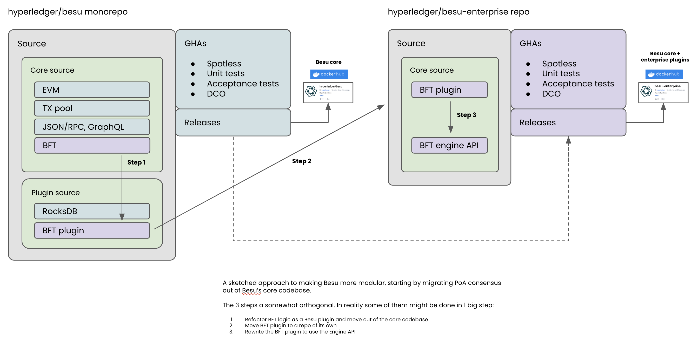

# Modular Besu

> [!NOTE]
> This page consolidates the Modular Besu design discussion and its sub-pages (Modularity Implementation Approach, Modular Consensus, Besu Software Component Map, and the original "Besu as a Modular Client for the Merge"). It is a historical record of design thinking around making Besu more modular.

Modularization of Besu - can we make Besu more flexible by factoring it into decoupled components which can be exchanged for alternate implementations?

**Goal of this document:**

- Starting a conversation about modularizing Besu.
- Keeping track of the discussions.

## On this page

This is a long, consolidated page. It opens with the overall modularity discussion ([context](#general-context), [goals](#goals), [potential benefits](#potential-benefits), [concerns and mitigations](#general-concerns-and-challenges-possible-mitigations), [minimum useful components](#besu-minimum-useful-components), [first steps](#potential-first-steps), and the [Erigon meeting debrief](#debrief-of-meeting-with-erigon)), and then merges four related sub-topics:

- [Modularity Implementation Approach](#modularity-implementation-approach) - how modules are divided into business logic vs. cross-cutting concerns, and a proposed proof-of-concept.
- [Modular Consensus](#modular-consensus) - a preliminary approach to modularizing consensus (BFT) via the plug-in system.
- [Besu Software Component Map (DRAFT)](#besu-software-component-map-draft) - a tour of how the Besu codebase is organized into Gradle projects.
- [Besu as a Modular Client for the Merge (OLD)](#besu-as-a-modular-client-for-the-merge-old) - an older comparison of two approaches to a lean execution-engine client.

## General context

We are getting various signals that the future of blockchain technologies is all about modularity. If L2 chains on top of L1 chains are the future, how can we make an L1 client that can be composed from various implementations of sub-components? We also see evidence of this elsewhere - The Merge separated consensus from execution. MEV actors like Flashbots separate proposing a block from building it. Even within clients, we see teams like Erigon re-writing their client in different languages, and combining the best performing subcomponents regardless of language.

Apart from the general direction of blockchain, software has been trending away from monolithic implementations, in order to maximize developer efficiency and reduce change fatigue. Smaller components can reach stability more easily than large monoliths can.

## Goals

The goals of this work are to expand the contexts in which Besu can be valuable to users and operators while reducing tech debt in maintenance of the code base and its release process. New use-cases require client modification (customization of Besu's rules). New use-cases may also want some, but not all, of the functionality that Besu provides. These use-cases may also want an easy way to package and distribute their work with Besu's permissive licensing.

To support flexibility and development of Besu in novel contexts going forward, the client needs a new approach to its existing monolithic architecture. Today, the protocol schedule defines how the monolith operates, with different sets of rules, but is unwieldy and hard to modify. We need a new approach that allows for the evolution of the client without the baggage of the monolithic approach.

Enter modularity.

The modularity work can be largely set against three goals:

1. Resolution of tech debt - to support today's existing use-cases in Besu, we have an unwieldy monolithic approach. This is becoming hard to manage and should be addressed (with the added benefit of the two below goals).
   1. Incremental, mergeable, no big bangs, review cycle to warrant inclusion.
2. Better Distribution - Tailoring the code-base by customizing a set of modules of "Besu" to provide users exactly what they need in context. I.e. I need a private network distribution of Besu, so I need PoA consensus, but not PoW validation rules. These distributions can also have their own CI/release process to adjust testing definition and quality standards. These can also be for individual modules like the EVM.
3. Better Client Modification - Tailoring the run-time to suit user/developer needs, allowing for deep customization of the client, its rules, and components. Here we have some approaches:
   1. Plug-ins and the plug-in API - Using the existing plug-in API, developers can inject modifications into the Besu code at start up that replaces the "vanilla" rule-sets and functionality. It also allows for new components to interface with Besu via the API, but does not allow for whole-sale swapping of components.
   2. Modules - Creating boundaries and interfaces in the code-base so Besu's existing components can stand-alone and/or be replaced with like modules. This opens up the client to flexibility of its modules, like replacing the EVM or consensus mechanisms with novel ones (or a new storage/peering stack, etc.). This can help with tech debt, but is a heavy-handed approach to customization.
   3. Remote APIs - It is currently possible to drive a blockchain purely over the rpc-apis, using the Engine API developed to facilitate Proof of Stake. This approach could be expanded to allow for other use cases that want to interact with the blockchain.

The latter two goals are somewhat linked. Distributions can be tackled with any client modification approach. APIs vs. modules, however, should be considered as differing tracks.

## Potential Benefits

With the above in mind, we outline some potential benefits:

1. Releases - finer grained components could have a finer grained release process, speeding up the release cycle.
   1. Distributions can be cut more easily for specific use-cases, based on what components and customizations to the base client are needed (Mainnet, ETC, Private nets, standalone EVM).
2. Customization - Modular components with plug-ins enable customization of the client to fit the needs of different use-cases in a clean way, with well-defined APIs and module boundaries.
   1. Linea Rollup definition, using plug-ins and novel components to allow Besu to operate an L2 network. Distributing these changes in a repeatable, reliable way to users and node operators.
3. Increases pace of innovation - experiments and prototypes become much easier, faster, and lower risk to pursue.
   1. New use-cases for Besu can be piloted quickly, without maintaining complex forks of the Besu client.
4. End User Control - software modularity should lend itself easily to greater customizability for the end user.
   1. Client modification can be done easily by swapping or altering components. Altered components are Besu at their core, but the plug-in system changes their behavior. Modular components may be Besu components or completely novel components that work with Besu via documented interfaces (i.e. a Rust EVM).
5. Reduces cognitive complexity - better defined scope for contributors to target a specific part of the codebase. New developers can focus more narrowly, and get up to speed faster with fewer distractions.

## General Concerns and Challenges, Possible Mitigations

1. Engineering effort around Besu
   1. Large engineering effort - we will need to always prefer incremental delivery over greenfield or big-bang approaches.
   2. Series of workshops to define the work.
2. Technical project organization
   1. Communication planning
      1. Internal - how do we make sure all Besu contributors can keep their finger on the pulse of this initiative.
      2. External - do we need to convey this to external users or interested parties? If so, how?
   2. Multi-stakeholder discussion, federating people around modular Besu. Examples of stakeholders this would benefit:
      1. MEV searchers
      2. Rollup implementers
      3. Infrastructure providers
      4. Developers

## Besu Minimum Useful Components

Hypothetical situations that would benefit from component composition:

- Isolatable execution engine (see [Approach #2 below](#approach-2-an-execution-engine-shell-project)).
  - EVM and state are needed and not the Consensus. Ex: Rollups, Hedera Hashgraph, EVM testing tools.
- Transaction pool, transaction validation, and block gossip needed. MEV searchers.
  - Possibly EVM needed for gas use analysis.
- Use case specific builds (see [Approach #1 below](#approach-1-besu-as-debian)).
  - All-in-one mainnet client that provides Ethereum proof-of-stake as its only consensus mechanism.
- State Sync Testbed, rapid prototyping for data stores which can be populated with state changes from a moving chain.

## Potential First Steps

- [Catalog all components](#modularity-implementation-approach).
- Test approach on one or more situations listed above.
- Extrapolate out a rough timeline on MVP scope and modules timing vs the catalog.
- Scope MVP (minimum viable platform).

## Questions

1. Plug-ins vs. modules - will we expand the plug-in API to be unwieldy and exposing too much?

## Debrief of meeting with Erigon

**Meeting #1 - 9/14/21**

Participants: Alexey, Madeline, Sajida

- Sentry component.
- C++ and rust implementations are being done.
- Each reimplementation takes less time than the precedent.
- Contrary to popular belief, it's not hard to rewrite things from scratch. Might even be easier.
- Alexey wants to start a Java reimplementation, and they don't have anyone to do it in Java.
- Besu in 2/3 years - he sees a dead end for the monolith model like besu, nethermind, openE.
- Geth snapshotter; Geth realised that traversing the tree.
- Collaboration would be:
  - Join their family of products.
  - Reimplement core product like evm.
  - Make them compatible with their other components.
  - That will be a 4th compatible implementation to their portfolio.
- Erigon is funded by EF, Gnosis and a small amount from various orgs.
- They are hiring for the go implementation; they have 2 active devs, they might bring a couple of others - it is a small team.
- C++ team: 4/5 ppl.
- Rust team: 2.5 ppl, some of them are not employed but just contributing part time.
- Cycles of modularization:
  - 1st rewrite: 2017 - 4 years or 3.5 years.
  - 2nd rewrite May 2020 - C++ with a couple of ppl; now they are almost finished the core component (1.5 years), might get the core component roughly finished end of 2021.
  - 3rd rewrite Jan 2021 - rust, could get to the same level as the others by the end of 2021, so 1 year; Rust will be ahead of the C++ implementation.
- He predicts that with Besu in 6 months because we already have a codebase, we don't start from scratch.
- Should we join the effort? Should we invest in Erigon?

**Meeting #2 - 10/6/21**

Participants: Artem +1, Gary, Sajida

- Starting from scratch is easier than refactoring existing code into Erigon architecture.
- Artem used to work on OE and is now working on Akula (rust) mainly alone for 4 months and it's already passing consensus.
- Modularization:
  - Breaking the monolith - reusable parts: tx pool, consensus engine, sync module.
  - Sync module is interesting alone to process by block or by stage.
  - Might require a change of database; stage sync requires MVCC database (LMDB, Badger LSM based, B+).
  - It might be possible to start module by module.
  - Data model could be a good start (might reduce space consumption).
  - We already have a pluggable storage engine. The interface of the pluggable storage resembles MDB/LMDB/DBX. The peer-2-peer part (sentry) of Geth was re-used by Erigon but the plumbing is totally different.
  - Erigon is heavily optimized toward sequential writes. Random reads / sequential writes - very fast for MDBX.
  - EVM bug leveraging a hole in the memory as triggered by a tx, that was broadcasted everywhere and affected all clients (even on Binance smart chain) - spreads like wildfire.
  - If they have a clique ethereum, fork the module, modify it and connect to JRPC and connect the rest of Erigon. You just had to invest time in creating a module and you get the rest of the client for free.
  - Erigon can be run as a Kubernetes cluster.
- Transaction pool should get EVM inside and be able to be part of the consensus. It is a security parameter. If we have a DOS attack, the tx pool should guard the blockchain from an attack. Having multiple tx pools that could coexist: one for MEV, one maybe getting DOS in this scenario and one running smoothly. And then you can pick the one that can do the work. Any tx pool could go down while the node is still up.
- The idea of modularity: you make the core, the spec, and the rest is up to you.
- Andrew: maintainer of the yellow paper, has an enum that maps to yellow paper parts. He runs silkworm - very good resource to start the work.
- Estimation: 2 engineers in 4 months. (Artem did it alone in 3/4 months.)
- R&D type of work, 100% dedicated team; no mainnet work.
- [Silkworm and Akula: the future of Erigon](https://medium.com/@giulio.rebuffo/silkworm-and-akula-the-future-of-erigon-fda4d6813505).
- Staged sync: [erigon staged sync README](https://github.com/ledgerwatch/erigon/blob/devel/eth/stagedsync/README.md).
  - Download headers/download blocks: 2 first stages, then silkworm will run the blocks.
- Leading C++ implementation at this point: [Silkworm](https://github.com/torquem-ch/silkworm).
- Very fruitful to invest R&D in this because lots of work has been done, so the cycle of reimplementation is getting smaller.
- Refactor: use case → modularity for L2, rollups, pluggable, MEV.
- Argument:
  - Database - we (besu) have a trie in a trie MPT (access complexity is multiplied). So just switching to another data model would increase our performance.
  - Erigon threw out the MPT (merkle patricia trie) completely and computes state root post execution; other than that we have a flat state. Plain state table: value = account, key = account address. We are almost there with bonsai on the flat storage but we should work on simplifying.
  - Using JRPC sure adds communication overhead but it brings so much value in other places that they (Erigon) can live with it.

## Modularity Implementation Approach

### Context

Making Besu more modular requires thinking about the dimensions along which those modules are divided up and separated from each other. Those separations can be categorized into two types: areas of related business logic, and areas of related software function. The former is the domain of "stuff Ethereum needs" and the latter is the domain of "stuff good Java software needs". When we modularize Besu, we are looking to produce reusable, composable software components within the business logic domain.

Bounded Contexts / Business Logic / Blockchain Domain are all synonyms for the type of modules we want to create. We will know we are doing this right when users can easily create a Besu that combines different modules into the client they need.

Cross Cutting Concerns are a little bit different. These should be invisible to the users, but very helpful to the developers. Any Bounded Context may depend on any mix of Cross Cutting Concerns. This part is ok to be a web of dependencies; they are often external projects/libraries we have selected for use all throughout Besu.

| Business Logic | Cross Cutting Concerns |
| --- | --- |
| 1. Consensus   1. Proof of Work   2. External (or none?): Proof of Stake     1. driven by Engine API   3. IBFT   4. QBFT 2. P2P   1. ETH/66 and prior   2. DevP2P 3. Execution   1. EVM   2. Tracing 4. Transaction Management   1. Tessera integration   2. MEV   3. public and private transaction support   4. Proof of work tx validation 5. Synchronizing   1. Full sync   2. Fast sync   3. Snap sync   4. Checkpoint sync   5. Backwards sync 6. Storage   1. World State     1. Forest     2. Bonsai     3. Snapshot (RocksDB specific)     4. Verkle   2. Blockchain   3. Key-Value specific implementations under each. | 1. Cryptography   1. Elliptic Curves   2. Signatures   3. Hashing   4. native implementations 2. Serialization   1. RLP   2. JSON   3. GraphQL 3. APIs   1. RPC     1. HTTP     2. Websockets   2. GraphQL   3. IPC 4. Inversion of Control   1. Dagger   2. Spring 5. Observability   1. Logging   2. Metrics   3. Debugging extras 6. Configuration   1. PicoCLI   2. Genesis state vs. named networks 7. Builds   1. Static code analysis   2. Use-case specific distributions   3. test automation     1. Unit     2. Integration     3. System     4. Fuzz |

### Goals

1. Pick relevant modules for abstraction against the goals outlined for Modular Besu. A good consideration is the rule of threes: we should only abstract a module when we have a need for it in three contexts.
2. Begin work on one abstraction.
   1. Document approach.
   2. Design implementation of interface or inversion of control.
   3. Review software engineering practices with the working group.
   4. Review code changes and implementation details with the working group.
3. Define success criteria for remaining modules.
4. Template design work from one slice and share learnings.
5. Determine remaining modules (what needs new abstraction, against our goals).
6. Create working group plan and discuss division of work.

### Proof of Concept

Introduce Inversion of Control to implement a vertical slice of functionality. We need to find a feature that touches on a few cross-cutting concerns, but just one Bounded Context.

Nominees:

1. Transaction validation stack - touches each consensus mechanism, any L2 network, MEV, block building, and more. Good candidate.
2. MetricsSystem - Each time we need to expose a metric, we need to get this MetricsSystem from upper layers and transfer it from constructor to constructor.
3. Configuration management.
4. Jumpdest caching. Only relevant to the EVM, but requires caching, configuration, observability, and hashing. Plan would be to provide each of these as a dependency.
5. PoA consensus mechanisms. Impact TBD.
6. Transaction pool. Impact TBD.
7. Merge Context. What if the Merge Coordinator and related classes could be a dagger module?
8. Protocol Schedule. Impact TBD.

Once the question of "will dependency injection make for cleaner composition of modules into an application" is answered, we can then start to incrementally adopt it within each bounded context, and across the cross-cutting concerns.

## Modular Consensus

### Context

This describes a preliminary approach to modularizing the consensus mechanisms in Besu using the plug-in system and accompanying refactoring. The goals of this modularity are to remove friction in development of Besu and to ensure users can always take the latest updates, regardless of their consensus mechanism.

### First Steps

Establish a working group. Review the [Modularity Implementation Approach](#modularity-implementation-approach).

A possible approach to starting BFT modularity:

Some suggested aims/ideals for BFT modularity. Not all of these may be possible, but starting with them in mind will help us identify when we have deviated from them, and make sure appropriate docs etc are written to help users migrate:

1. An existing Besu user can stop their Besu node, pull the new modular Besu image, and restart their Besu node without resyncing.
2. The user experience of running a Besu QBFT chain is unchanged.
3. A Besu QBFT node can be run in a single runtime.
4. BFT-related metrics continue to be produced without name changes.
5. Existing BFT-specific configuration is honoured (config or genesis file settings).
6. No additional ports are required to be opened to run a modular Besu QBFT network.
   1. I.e. BFT validator peering logic continues to run over the standard P2P port.

## Besu Software Component Map (DRAFT)

> [!NOTE]
> This is a draft document attempting to explain the layout of the Besu project at the time of writing. Project structure has since evolved. We attempt to answer the question "why is this organized the way it is?" Software components to be considered include but are not limited to Gradle projects, GitHub repos and sub-modules, and Java packages.

### Design Values

There are various trade-offs we make when deciding where a software component fits in our mental model. Those trade-off choices reflect our values in organizing software, and are useful when considering where to put something and how to name it. Having a variety of values also allows us flexibility in our choices, without being constrained by a need for consistency.

- Monorepos: We value a single repo to house all submodules, since it is easy to search, and allows for greater reuse and inter-dependency. For instance, our tests may depend on a wide variety of components, depending on how high the testing scope goes. Not everything should be tested via unit tests, and for integration and system scoped testing, it is very likely to depend on many different components.
- Single Binary: This is a packaging concern that allows all the various runtime options for Besu to be met by a single executable.

### Gradle projects

At the time of writing, Besu was divided into many different gradle projects. Each of the bullet points below could likely be expanded a bit, and perhaps a README.md added next to each `build.gradle` file explaining it.

- **acceptance-tests** - What scope of testing does this represent? Who/what is doing the accepting implied? Seems to provide a DSL to be used to write tests. Do these tests depend on the besu implementation specifically, or do they run over RPC and could be divorced from the besu implementation code?
- **metrics** - rocksdb is an entire gradle project for only 1 class. This was likely done to isolate the metrics used to observe this db implementation. The core seems to be the metrics reporting scaffold, not besu specific, makes sense as its own module.
- **consensus** - consensus seems a little more important than just a feature. Looks like it is only the PoA stuff. Each consensus mechanism has a means of creating a block, has some corresponding rpc methods, may have some unique network messaging, and means to validate other proposed blocks. The common module has a lot of bft related stuff, probably extended by ibft2 and qbft.
- **crypto** - probably makes sense to package by function instead of by feature here, to help avoid rolling your own crypto. Much easier to audit and upgrade all in one place.
- **enclave** - isolates the code needed to work with key management appliances used during PoA-based private enterprise nets. It's the code for communicating with private p2p enclaves such as Tessera and Orion. It's mainly used for private ethereum networks.
- **util**
- **config** - a single package containing configuration structs, mostly for PoA consensus.
- **plugins** - only contains the rocksdb submodule. This is a pluggable key value store implementation.
- **nat** - figuring out the client's IP address is non trivial in many of the environments we expect it to run.
- **container-tests** - pretty small module, looks like it is to be used by CI/CD in order to test configuration and startup of besu containers.
- **plugin-api** - toolkit for devs who want to build plugins for besu.
- **besu** - this can be thought of as the application module. Contains things the user interacts with, such as the command line interface, export tools (for exporting blocks to the filesystem), import tools (for direct importation of blocks from the filesystem), controllers, and services (implementations of the plugin-api).
- **privacy-contracts** - example contracts to be used on PoA networks.
- **testutil** - same as util package, but for tests. Utility classes to be used when testing enterprise features like Enclave, Orion and Tessera.
- **services**
- **ethereum** - this is where ethereum protocols are implemented. All clients likely have implementations analogous to those found in this module. Are ethstats and evmtool specific to Besu, or are they implementing a spec that is common across clients? What is the scope of retesteth and referencetests?
- **error-prone** - project specific rules to be enforced by the errorprone compiler.
- **pki** - a layer of abstraction up from cryptography. This module handles dealing with keystores and certificates, likely used by PoA networks.

## Besu as a Modular Client for the Merge (OLD)

> [!NOTE]
> This is an older design document written around the time of The Merge. It is preserved for historical context.

Considerations for this work:

The Merge is 'different'. The switch from proof-of-work to proof-of-stake changes the behavior of the client significantly. There are additional endpoints served from a new `engine` network service which are differently secured than existing json-rpc or web sockets services. Knowing when to make the switch from one to the other also does not follow the 'hard fork' strategy from previous Ethereum upgrades. Also, presumably only Ethereum mainnet (and its test nets) would ever make this transition.

Other layer1 EVM chains are unlikely to need an execution engine client. However, layer2's might. This [thread from protolambda](https://docs.google.com/document/d/1LqtQcjxx5smMF43qvkbwp3Q1dNkTev1KB0BzvbE7dSI/edit) highlights the potential for an execution engine to be leveraged in rollups. Having a clean execution engine module would likely be useful and less cluttered than trying to adapt besu to an L2 use case.

Lastly, we are working on incorporating MEV strategies into besu. MEV so far seems to be only a consideration for Ethereum mainnet, and the notion of splitting the block producer role into two roles, [blockBuilder/blockProposer](https://ethresear.ch/t/proposer-block-builder-separation-friendly-fee-market-designs/9725), likely would not make sense outside of the context of Ethereum mainnet and MEV auctions.

### Considerations common to both approaches

- Pros
  - The effort to modularize is underway already for the evm.
  - This dovetails nicely with the need to have pluggable MEV strategies.
- Risks
  - Finding the right 'bounded context' for libraries is non-trivial.
  - The effort of refactoring Besu into modules becomes critical-path for having a besu-based execution client.
  - Changes the value proposition of the project - no longer is besu "an ethereum mainnet ready client". This is going to be the case post-merge anyway, but it is worth pro-actively redefining the message.
  - Adds devops considerations for publishing modules.
- Mitigation
  - We can initially rely on the existing submodules for library bounds.
  - We can continue to pursue a branch-based approach for an execution client in parallel until we have clarity and modularization.

### Approach #1 "Besu as Debian"

1. Split up the current monolithic besu artifact into a group of reusable libraries which are published individually.
2. Rather than a monolithic artifact, generate distribution-specific artifacts within the project. An example of a distribution artifact might be "ethereum execution engine", "ETC mainnet ready client", "Optimistic Besu", etc.
3. External projects that wish to leverage besu artifacts and/or build a 3rd party Besu distribution are able to leverage the published besu artifacts.

This would keep besu as a central project that natively supports a variety of use-cases via use-specific distribution artifacts. This would be different from the current setup only in that there would not be a single monolithic binary.

- Pros
  - Teku can directly integrate/implement besu for its default execution engine.
  - Enables different "distributions" of Besu, with artifacts custom tailored for individual chains, rollups, and/or applications.
- Risks
  - Might present some political challenges; we would have to solicit buy-in from governance and contributors for example.
  - Would have to do distribution-specific acceptance tests for each artifact. This would require additional devops and CI plumbing.
- Timeline
  - ? (incremental approach)

### Approach #2 "An Execution Engine Shell Project"

Create a new project for the execution engine, leveraging the besu modules. Rewrite, override or extend the portions of besu necessary to deliver a lean execution client without introducing any of the Ethereum PoS merge code into besu. This would be a step in the direction of treating besu as more of a general purpose reference implementation of its libraries, rather than an "ethereum mainnet ready client".

- Pros
  - Less need to coordinate with other concerns: enterprise, other public mainnets.
  - Submodules and functionality that are unrelated to Ethereum mainnet are just unimported.
  - Onboarding of new engineers may be faster - no need to understand the whole codebase, just the specific rules of the execution client.
  - Lower cyclomatic complexity would inevitably lead to better performance.
  - A standalone execution engine could be leveraged in rollup implementations.
  - Greater simplicity, performance, and integration with new services.
- Cons
  - Inevitable drift from re-implemented portions of besu, causing duplication of work for bugfixes and shared features.
  - Likely no resources or support from besu contributors.
  - Work on the execution engine would be split across multiple repositories.
- Timeline
  - 6-9 months; relies on the modularization of besu to begin in earnest.
