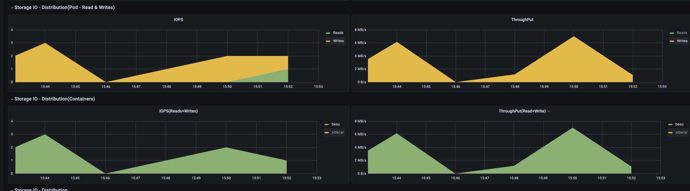
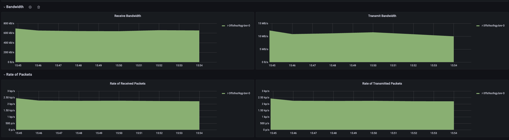
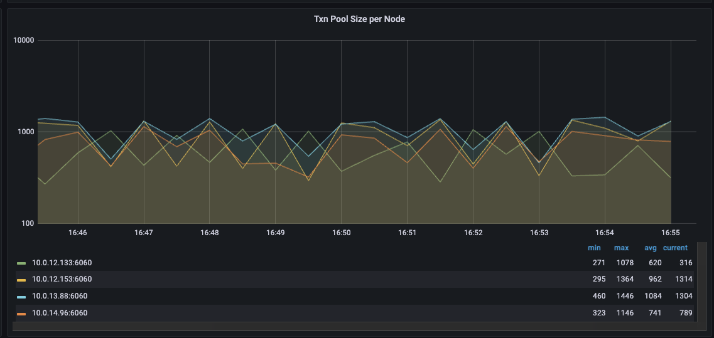
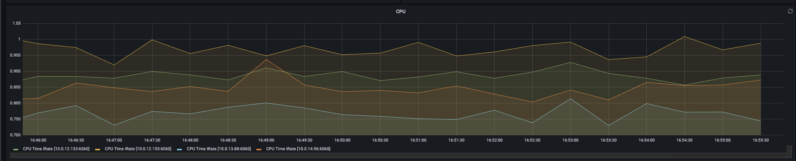
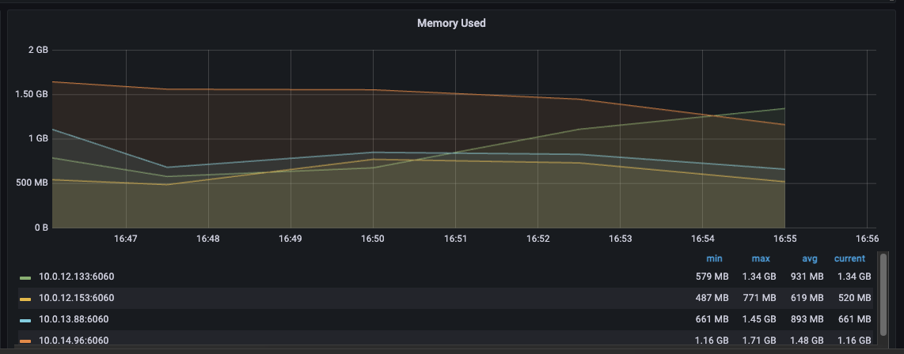

# Permissioned chain performance testing

This page includes various setup and testing results for different permissioned chain scenarios, covering the different scenarios currently being exercised.

- [QBFT, Bonsai, and Snap-Sync testing](#qbft-bonsai-and-snap-sync-testing)
- [QBFT Performance](#qbft-performance)

## QBFT, Bonsai, and Snap-Sync testing

**Update:** PR [https://github.com/hyperledger/besu/pull/7140](https://github.com/hyperledger/besu/pull/7140) is now merged and adds working experimental support for QBFT + Bonsai + Snap sync.

Previous notes below.

Prior to being able to recommend Bonsai and/or snap sync for permissioned chains, work was needed to make the combination of QBFT, Bonsai, and snap-sync work reliably.

Summary of PRs related to this work:

1. [https://github.com/hyperledger/besu/pull/7204](https://github.com/hyperledger/besu/pull/7204) (merged to main) — prevents persisting of proposed blocks to ensure only committed blocks are persisted to world state.
2. [https://github.com/hyperledger/besu/pull/7140](https://github.com/hyperledger/besu/pull/7140) (WIP) — adds an experimental flag to enable QBFT + snap sync. Quits snap-sync early when a new chain scenario is detected.

Issues seen before now when Bonsai and/or snap-sync is used with QBFT:

- [https://github.com/hyperledger/besu/issues/6680](https://github.com/hyperledger/besu/issues/6680)
- [https://github.com/hyperledger/besu/issues/6053](https://github.com/hyperledger/besu/issues/6053)

For those working on this feature, a `4-validator-dir.tar.gz` test fixture can be used to run a 4-validator QBFT chain for testing. The 4th node has `Xsynchronizer-world-state-request-parallelism=1` set; without this, the account data range requests fail to all be marked as complete.

> [!NOTE]
> The `4-validator-dir.tar.gz` fixture is not included in this wiki. It remains available in the `confluenceExport` branch under `besu/performance-stability/permissioned-chain-performance-testing/attachments/`.

## QBFT Performance

The configuration settings below provide a consistent setup for collaboration on QBFT performance work. For ease of collaboration, all performance tests are being done using Caliper (see config below). Performance for a QBFT chain is not strictly "how fast does the chain go" or "what TPS can be achieved". A chain can peak at higher TPS for a short period of time, but then blow its TX pool due to growth beyond the TX pool size. The results below are for continuous, stable operation. Typically this means no less than 10,000 transactions per caliper run (10k is usually enough to blow the TX pool if you push it too hard).

### 4-node QBFT chain with Forest DB

Current best results.

Caliper "open" test using caliper simple contract:

- 1 caliper connected to a single node: 750 TPS
- 2 calipers connected to individual nodes: 950 TPS
- 2 calipers connected to their own node: 1200 TPS

Caliper ERC20 token transfer test:

- 1 caliper connected to a single node: 520 TPS
- 2 calipers connected to individual nodes: 570 TPS
- 2 calipers connected to their own node: 645 TPS

Setup:

- 4 QBFT validators
- Configuration:
  - Env:
    - `BESU_OPTS=-XX:MaxRAMPercentage=70.0`
  - CLI:

    ```
    besu --discovery-enabled=false --Xdns-enabled=true --Xdns-update-enabled=true --min-gas-price=0 --data-path=./data --genesis-file=../genesis.json --rpc-http-api=ETH,QBFT,ADMIN,NET --rpc-ws-api=ETH,QBFT,ADMIN,NET --metrics-port=6060 --logging=INFO --rpc-http-enabled=true --rpc-ws-enabled=true --graphql-http-enabled --metrics-enabled=true --remote-connections-limit-enabled=false --tx-pool-disable-locals --tx-pool=sequenced --tx-pool-limit-by-account-percentage=0.55 --rpc-http-max-active-connections=300 --data-storage-format=FOREST --cache-last-blocks=32
    ```

  - Besu start logs:

    ```
    # Java: -ibmcorporation-eclipseopenj9vm-java-17
    # Maximum heap size: 7.00 GB
    # OS: linux-x86_64
    # glibc: 2.35
    # jemalloc: 5.2.1-0-gea6b3e973b477b8061e0076bb257dbd7f3faa756
    # Total memory: 30.83 GB
    # CPU cores: 8
    ```

  - Pod limits/requests:

    ```
    Limits:
     cpu:     4
     memory:  10Gi
    Requests:
     cpu:     2500m
     memory:  5Gi
    ```

- K8S node size:
  - m6i.2xlarge
  - gp3 storage
  - Capacity:

    ```
    attachable-volumes-aws-ebs:  39
    cpu:                         8
    ephemeral-storage:           104845292Ki
    hugepages-1Gi:               0
    hugepages-2Mi:               0
    memory:                      32329184Ki
    ```

Deployment:

- 4 nodes running in the same AWS AZ.
- Caliper instances running on m6a.2xlarge EC2 instance in same region.

Genesis file:

```json
{
  "alloc": {},
  "coinbase": "0x0000000000000000000000000000000000000000",
  "config": {
    "berlinBlock": 0,
    "chainId": 90001,
    "qbft": {
      "blockperiodseconds": 2,
      "epochlength": 30000,
      "requesttimeoutseconds": 10
    }
  },
  "difficulty": "0x1",
  "extraData": "0xf83aa00000000000000000000000000000000000000000000000000000000000000000d5943edcd4d1ea9fe0b8d5e438fb8e8a5d138214479ac080c0",
  "gasLimit": "0x174876e800",
  "mixhash": "0x63746963616c2062797a616e74696e65206661756c7420746f6c6572616e6365"
}
```

Caliper scenario (4 instances running with this config):

```yaml
test:
  name: simple
  description: >-
    This is an example benchmark for Caliper, to test the backend DLT's
    performance with simple account opening & querying transactions.
  workers:
    number: 1
  rounds:
    - label: open
      description: >-
        Test description for the opening of an account through the deployed
        contract.
      txNumber: *number-of-accounts
      rateControl:
        type: fixed-rate
        opts:
          tps: 750 # tps for opening the configured number of accounts
      workload:
        module: benchmarks/scenario/simple/open.js
        arguments: *simple-args
```

### Logs

Log files for one node and one caliper instance during a short performance run were captured (`node.log` and `caliper.log`). Note ~110 TPS performance for the caliper instance, as there were 4 instances running (this run was actually configured with both open and transfer caliper tests).

> [!NOTE]
> The `node.log` and `caliper.log` files are not included in this wiki. They remain available in the `confluenceExport` branch under `besu/performance-stability/permissioned-chain-performance-testing/attachments/`.

### Metrics

Some screenshots of metrics during a ~420 TPS run.

Storage IO for one node in the group:



Network UI for one node in the group:



TX pool size for all nodes:



CPU load for all nodes:



Memory usage for all nodes:



### Flame graphs

The following graphs were captured on 2 of the nodes using `async-profiler` with the following settings:

```
-agentpath:/opt/async-profiler/lib/libasyncProfiler.so=start,event=cpu,loop=10m,file=profile-%t.html
```

These were captured in the middle of a 100k caliper test set to 105 TPS for each of the 4 caliper instances (totalling 420 TPS across them). Each of the 2 nodes the flame graphs were captured for had a single caliper instance connected to them.

> [!NOTE]
> The `profile-20240502-190200.html` and `profile-20240502-190204.html` flame graphs are not included in this wiki. They remain available in the `confluenceExport` branch under `besu/performance-stability/permissioned-chain-performance-testing/attachments/`.
