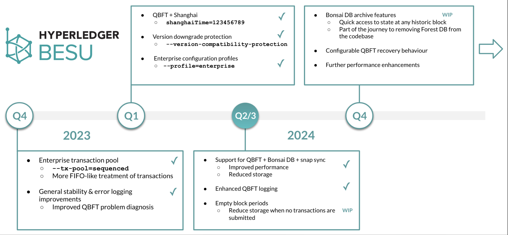

# Enterprise roadmap item detail

The enterprise roadmap is currently led by [Matthew Whitehead](mailto:matthew.whitehead@kaleido.io) from [Kaleido](https://www.kaleido.io/). To discuss the enterprise roadmap items reach out to [matthew.whitehead on the Hyperledger discord server](https://discord.com/invite/hyperledger).

  

The following is the roadmap summary slide that has been used in recent Hyperledger meetups:

  

### Empty block periods for QBFT chains

Draft PR [https://github.com/hyperledger/besu/pull/6965](https://github.com/hyperledger/besu/pull/6965) is work-in-progress and aims to add support for a different block period when no transactions are in the TX pool to be included in a block. It will have the benefit of reducing storage requirements for permissioned chains when no transactions are submitted to the network.

### QBFT, Bonsai, & Snap Sync

This feature adds experimental support for QBFT chains using snap sync to sync new nodes with an existing permissioned chain.

PR [https://github.com/hyperledger/besu/pull/7140](https://github.com/hyperledger/besu/pull/7140) was included in Besu 24.7.0 and once the function has been exercised enough by other users it will be migrated out of experimental.

### Permissioned chain performance

Wiki page [QBFT Performance](../../besu/performance-stability/permissioned-chain-performance-testing/qbft-performance.md) outlines work done by two of the Besu maintainers to understand some of the bottlenecks in a QBFT chain and determine the best tuning/configuration to improve overall TPS achievable in a permissioned chain.

As of 2H 2024 further performance work is on hold while other features (see below) are prioritised

### Bonsai archive support

Draft PR [https://github.com/hyperledger/besu/pull/5865](https://github.com/hyperledger/besu/pull/5865) started the work necessary to provide access to archive state when using Bonsai DB. This was paused for a period of time, and is now actively being progressed (see discord thread [https://discord.com/channels/905194001349627914/1261348506648707133/1261348712047706243](https://discord.com/channels/905194001349627914/1261348506648707133/1261348712047706243)). It is an important step towards the deprecation and removal of the Forest database, since archive nodes will not be possible with Bonsai until this feature is implemented.