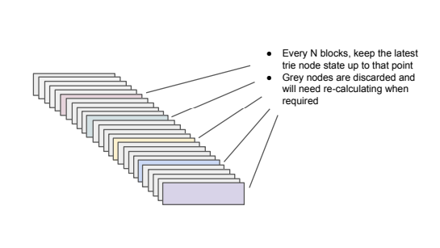
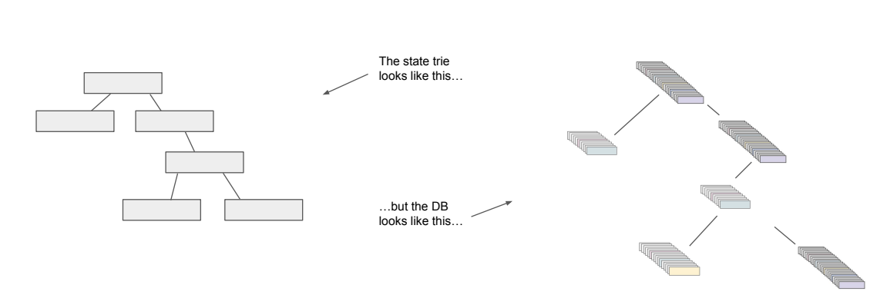
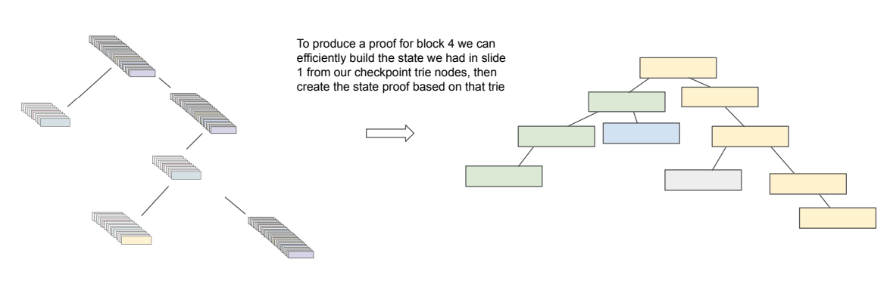
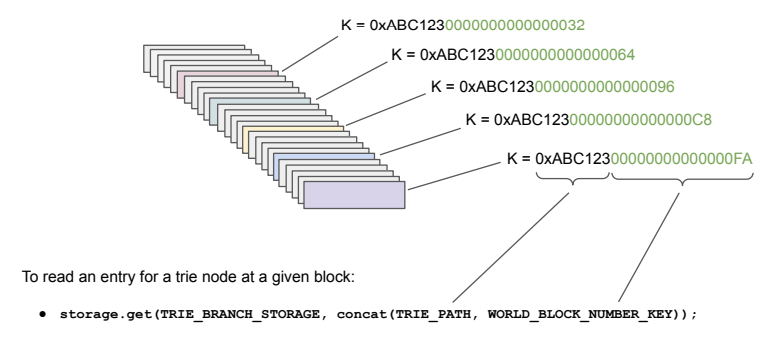

# Bonsai archive state proofs

This page follows on from [Bonsai archive feature](../design-documents/bonsai-archive-feature.md) and provides details of the design for implementing state proofs using the Bonsai Archive flat DB archive format as a basis.

The PR is here: [https://github.com/hyperledger/besu/pull/8669](https://github.com/hyperledger/besu/pull/8669)

I ended up writing the design & behaviour into a presentation for the Besu community call (see attached) but the design detail is explained below.

## Extension of the Flat DB design

Bonsai DB introduced a Flat DB, whereby a given account could be queried directly without navigating the state trie. This design allowed performant snap-sync query retrieval since snap sync requests are for ranges of accounts.

For Bonsai Archive the flat FB was extended to store the state of an account at a given block. So instead of just querying current account states from the flat DB, it could be searched for the account state prior to (or after) a specific block.

The state trie remained untouched because the first version of Bonsai Archive didn’t offer historic state proofs - only historic account states.

For Bonsai Archive with state proofs, the concept of querying the DB for a value prior to or at a given block was extended to the state trie. This forms the key design required to be able to rebuild the state trie at or before a given block.

In the following diagram, every coloured rectangle is the persisted content of a trie node in the state trie at a specific block. The grey nodes are the values of that trie node at intermediate blocks, which are node stored directly but can be calculated by taking the closest persisted value (coloured rectangle) and rolling back to the required block using Bonsai’s existing trie logs:

At the chain head, the state trie looks like the LHS of the following diagram, but the state DB looks like the RHS:

If a request for `eth_getProof` arrives for any block in history, the DB of “checkpoint” trie nodes can be searched, first to find the nearest checkpoint block we have for a given trie node, then to roll back the trie logs to create the complete state trie at the desired block:

The format of the Rocks DB key/values follows the same pattern used for initial Bonsai Archive accounts. The block number that a persisted trie node value represents is appended to the key (in this case the trie path) to create the DB key:

If a trie node entry doesn’t exist at the required block, the archive logic uses getNearest logic to find the nearest block **before** the one we have. (Currently the archive state proofs do not support searching forwards, which is a slight inefficiency that could be improved in the future).

The frequency of persisting a “checkpoint” value for a trie node is configurable, but once set for a Besu node it cannot be modified. For example, a Besu node may be configured with a checkpoint interval of 250 blocks:

- If a trie node was updated every single block, at most 1 DB entry per 250 blocks is persisted.
- If a trie node is set once at block 0 and then not modified until block 10000, there are no intermediate checkpoint blocks. There will be a flat DB entry at block 0, and block 10000. Building the state trie at block 7000 involves finding checkpoint block 10000 and rolling back by 1 trie log to block 7000 (which is the same state value as block 0)

## How trie node DB entries are handled in between checkpoint blocks

When blocks caused changes to trie nodes, the DB entry for the current checkpoint block is continuously updated with new values until a new checkpoint is passed. At that point, no further changes are made to that key value in the DB. For example, at block 100 for trie node key **0x05**, entries are written to the DB with suffix **0x050000000000000064**, then no further changes to the value of **0x050000000000000064** will ever be made. Its value is set forever.  

- If a node is updated at block 105, the entry 0x0000000000000064 is updated with a new value and so on.
- When we reach block 199 the last update to 0x0000000000000064 is written (if there is one), and then new  
updates for block 200+ are made with suffix 0x00000000000000C8
- 0x00000000000000C8 will be updated with new values until block 300, and so on  

Here are some example entries from a real DB at block 205 in a new chain. Checkpoints are every 100 blocks. The **orange** values are the PMT node path/location. The **blue** values are the checkpoint block suffix. The RHS is the value of that trie node.

  
0x**050000000000000000** ==> 0xF8518080808080A0253E6…  
0x**050000000000000064** ==> 0xF8518080808080A0253E6…  
0x**05050000000000000000** ==> 0xF869A0208AA36520B83F9…  
0x**050C0000000000000000** ==> 0xF86EA020D9D8A442C611…  
0x**050C0000000000000064** ==> 0xF86EA020D9D8A442C611…  
0x**050C00000000000000C8** ==> 0xF86EA020D9D8A442C611…  
0x**060000000000000000** ==> 0xF883A03C276B7180DCF065…  
0x**060000000000000064** ==> 0xF883A03C276B7180DCF065…  
0x**0C0000000000000064** ==> 0xF869A0365617775BABD6B8…  
0x**0D4455509DB54AD570526524416A469F52C01D371599BC31062539E8871373BD0000000000000000** ==> 0xE6A120290DECD9548B62A8D60…

[Bonsai%20archive%20state%20proofs.pdf](./attachments/Bonsai%20archive%20state%20proofs.pdf)