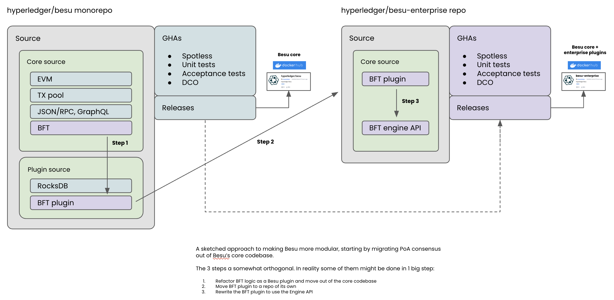

# Modular Consensus

# Context

This document lays out a preliminary approach to modularizing the consensus mechanisms in Besu using the plug-in system and accompanying refactoring. The goals of this modularity are to remove friction in development of Besu and to ensure users can always take the latest updates, regardless of their consensus mechanism. 

# First Steps

Establish a working group → Awaiting contributor call July 11th, 2023. 

See [Modularity Implementation Approach](../modular-besu/modularity-implementation-approach.md)

Review potential plug-in architecture:

[Besu%20Consensus%20Pluggable%20-%20Consensus%20Plug-In%20Surface%20Area.pdf](./attachments/Besu%20Consensus%20Pluggable%20-%20Consensus%20Plug-In%20Surface%20Area.pdf)

A possible approach to starting BFT modularity:

Some suggested aims/ideals for BFT modularity. Not all of these may be possible, but starting with them in mind will help us identify when we have deviated from them, and make sure appropriate docs etc are written to help users migrate:

1. An existing Besu user can stop their Besu node, pull the new modular Besu image, and restart their Besu node without resyncing
2. The user experience of running a Besu QBFT chain is unchanged
3. A Besu QBFT node can be run in a single runtime
4. BFT-related metrics continue to be produced without name changes
5. Existing BFT-specific configuration is honoured (config or genesis file settings)
6. No additional ports are required to be opened to run a module Besu QBFT network
  1. i.e. BFT validator peering logic continues to run over the standard P2P port