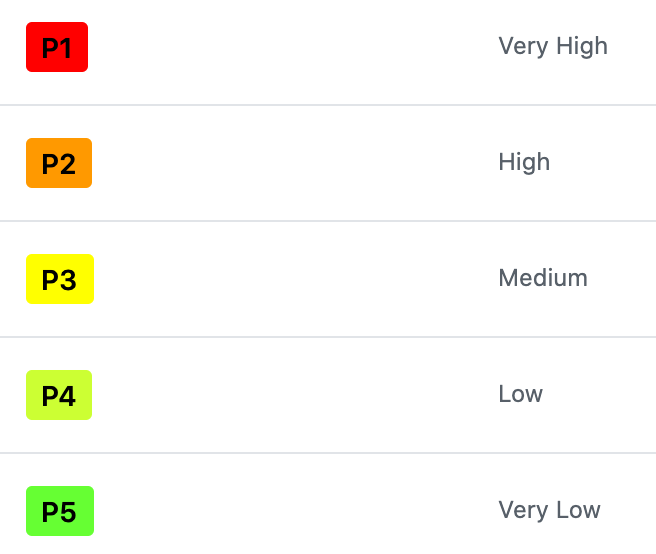
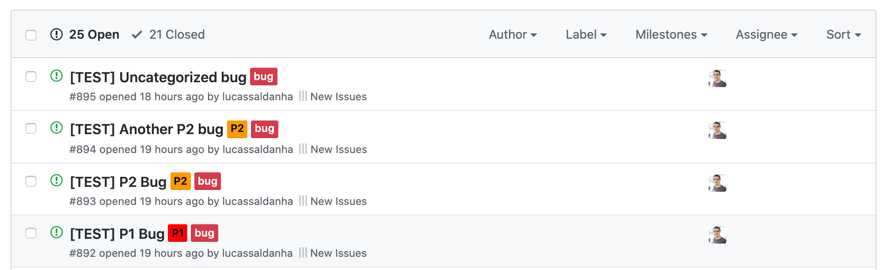

# Bug Triage Process

> [!INFO]
> For information on our defect prioritization policy, check out [this page](../developing-and-conventions/policies/defect-prioritisation-policy.md)

# What is Bug Triaging?

In Besu we have a [well-defined policy regarding bug categorization](../developing-and-conventions/policies/defect-prioritisation-policy.md). We categorize bugs based on their Probability (how often) and their Severity (how bad). Using these two scales, we end up with a final priority for the bug, that defines how important the bug is.

In a nutshell, our bugs are categorized into 5 priorities. If you want more details about the categories head to [our policy page](../developing-and-conventions/policies/defect-prioritisation-policy.md). These buckets are:

| Priority | Examples |
| --- | --- |
| Very High *(P1)* | - Security issues - Non-planned backward incompatibilities, preventing the node from participating in the network |
| High *(P2)* | - Degrading performance issues - Unexpected behaviour of core features (DevP2P, syncing, etc) |
| Medium *(P3)* | - JSON-RPC request not working with a specific client library due to some loose spec assumption |
| Low *(P4)* | - Node doesn't start up when the configuration file has unexpected "end-of-line" character |
| Very Low *(P5)* | - JSON-RPC json object response not ignoring keys with null value - Typo on a CLI command description |

# Why is it important?

All software has bugs. And sometimes we don't find them. This is something that we need to live with. However, when we do find bugs we need to do our best to identify the potential impact of that bug in our system.

A proper triaged bug helps up to prioritize and act on bugs in a timely manner. Also, by analysing the severity and impact of our bugs, we can create/update processes to ensure we are better prepared for them in the future.

# How to triage a bug?

All of our bugs are reported on GitHub issues. They are identified by the [BUG](https://github.com/hyperledger/besu/issues?q=is%3Aissue+is%3Aopen+label%3Abug) label.

We can make use of GitHub labels to categorize our bugs. We have 5 labels, P1, P2, ..., P5 to categorize a bug according to our policy:

By using labels, we communicate with maintainers and everyone else the priority of our bugs.

## Step-by-step process (for maintainers)

1. Identify that a bug doesn't have a priority (no Px label)
2. Use the [bug categorization policy](../developing-and-conventions/policies/defect-prioritisation-policy.md) to determine the final priority of the bug
3. Based on your assessment, add the corresponding label to the bug
4. (optional) Add a comment to the issue explaining the rationale (justifying the severity and probability analysis)

Here is an example screenshot of how we can spot bugs that have been prioritized (or the ones that still require an assessment):

# FAQ

## What if I don't agree with the priority of a bug?

We try to be deterministic on our assessments, and most of the time it will involve some discussion. However, if you feel like the assessment on a bug priority is wrong, you can always add a comment on the issue and start a discussion. There is also the option of starting a conversation on [Discord](https://discord.gg/hyperledger).

## Can I change the priority of a bug?

You can. However, if another person was responsible for the initial assessment it is expected that you will contact that person to share your thoughts before changing it.

It is a combination of being polite and reasonable. 

## What if I don't have enough knowledge of a specific area to prioritize a bug?

That's ok! Deeper understanding of the impact of a bug will come from the people that work closer to the affected area of the code. Leave it to them!