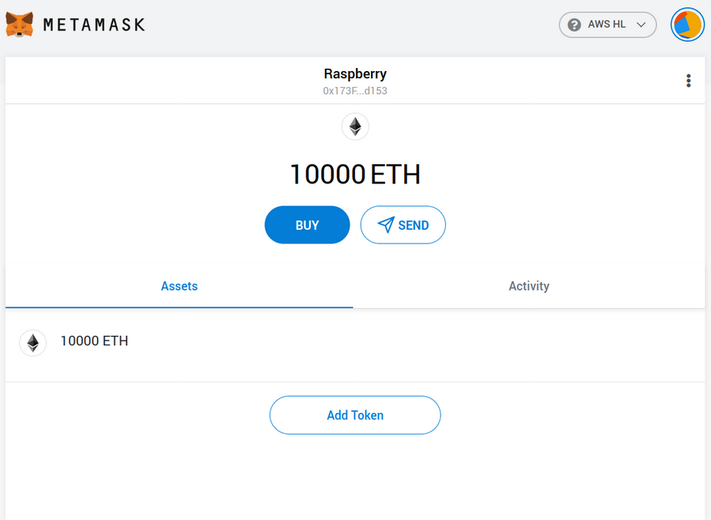

# Deployment of Private Hyperledger Besu on AWS with hardware layer for Externally Owned Account

In this post, we will show how to deploy a private Hyperledger Besu network on Amazon Web Services. Later on, we will discuss the minimum configuration of a Raspberry Pi to interact with the deployed network, making it a physical instance of an externally owned account with an ability to send signed transactions and interact with smart contracts. 

Note that this is only a teaser and an introduction to the topic and a more concrete and viable example of an application of the deployed infrastructure will be discussed in a separate post. Nevertheless, we will show how to connect a hardware node to the network,  able to interact with the blockchain, and in this regard, it can be treated as a blockchain enabler for IoT solutions. 

## Setting up Hyperledger Besu Infrastructure

For our scenario, we will provision a network of four Hyperledger Besu nodes, running an IBFT2.0 consensus, and deployed on Amazon Web Services. If, like us, you’re not a fan of dull and repetitive tasks, instead of manually creating all four nodes, you can use terraform to set the scene.

Below is the relevant HCL code that will create a security group called “tf-hyperledger-besu” with proper (albeit very permissive) firewall configuration and deploy four nodes tagged with names ranging from terraform-example-0 to terraform-example-3. Terraform will also create the folder structure we will require to configure the Hyperledger Besu client.

**Terraform configuration file** Expand source

```
provider "aws" {
  region = "eu-central-1"
  access_key = "XXXX"
  secret_key = "xxxx"
}

// Security Groups
resource "aws_security_group" "sg-besu" {
  name        = "tf-hyperledger-besu"
  description = "Hyperledger Besu Nodes"
  ingress {
    from_port   = 22
    to_port     = 22
    protocol    = "tcp"
    cidr_blocks = ["0.0.0.0/0"]
    description = "SSH"
  }
  ingress {
    from_port   = 8545
    to_port     = 8545
    protocol    = "tcp"
    cidr_blocks = ["0.0.0.0/0"]
    description = "RPC over HTTP"
  }
  ingress {
    from_port   = 8645
    to_port     = 8645
    protocol    = "tcp"
    cidr_blocks = ["0.0.0.0/0"]
    description = "RPC over WS"
  }
  ingress {
    from_port   = 30303
    to_port     = 30303
    protocol    = "tcp"
    cidr_blocks = ["0.0.0.0/0"]
    description = "P2P PORTS"
  }
  ingress {
    from_port   = 30303
    to_port     = 30303
    protocol    = "udp"
    cidr_blocks = ["0.0.0.0/0"]
    description = "P2P PORTS"
  }
}
resource "aws_instance" "tf-example" {
  // Red Hat Enterprise Linux 8 (HVM)
  count                  = 4
  ami                    = "ami-07dfba995513840b5"
  instance_type          = "t2.micro"
  vpc_security_group_ids = [aws_security_group.sg-besu.id]
  key_name               = "mbp_rsa (krzysztof)"
  tags = {
    Name = "terraform-example-${count.index}"
  }
  connection {
    type        = "ssh"
    user        = "ec2-user"
    private_key = file("~/.ssh/mbp_rsa")
    host        = self.public_ip
  }
  provisioner "remote-exec" {
    inline = [
      //"sudo yum -y groupinstall 'Development tools'",
      //"sudo yum -y install java-11-openjdk-devel",
      "sudo mkdir -p /opt/besu-data/IBFT-Network/Node/data",
      "sudo chown -R $(id --name -u):$(id --name -u) /opt/besu-data"
    ]
  }
}
output "instance_public_ip_addresses" {
  value = {
    for instance in aws_instance.tf-example:
    instance.id => instance.public_ip
    if instance.associate_public_ip_address
  }
}
```

Copy the code from above and save it in a `main.tf` file, stored in a dedicated directory. Then, from within that directory, initialize the terraform with `terraform init` and deploy the infrastructure with `terraform apply`. Within minutes, your four servers should be up and running.

### **Installing and configuring Hyperledger Besu on Node 0**

Once the provisioning has finalized, log into Node 0 and prepare the required software. First, we must make sure that all required packages are installed. Execute the following commands:

**Installing prerequisites**

```
sudo yum -y groupinstall "Development tools"
sudo yum -y install java-11-openjdk-devel
```

Subsequently, download the newest Hyperledger Besu binaries (we ran our experiments with version 1.4.6), unzip (or untar) them, and store the root Besu folder in its designated location (like `/opt/besu-1.4.6`). Don’t forget to add `/opt/besu-1.4.6/bin` to your user’s `$PATH` variable and, once you did so, restart the terminal session. 

Next, you’ll need to create node keys and a genesis file. I would recommend roughly following [the official documentation](https://besu.hyperledger.org/en/stable/Tutorials/Private-Network/Create-IBFT-Network/), but with some minor modifications. For one, unlike in the tutorial, we’re configuring four independent nodes, and not four Besu services all running on one machine, so keep that in mind when moving genesis file and node keys around. 

If you follow the tutorial, pause when you’re about to start the first node. Instead of just executing the command, let’s do it the right way by creating a `systemd` service.

Create a file in `/usr/lib/systemd/system` called `besu-node-1.service`. And paste in the following contents:

**Besu service configuration** Expand source

```
[Unit]
Description=Hyperledger Besu (IBFT Node 1 / Bootnode)
After=network.target

[Service]
# Besu - Node settings
Environment=BESU_DATA_PATH=/opt/besu-data/IBFT-Network/Node/data

# Besu - Chain settings
Environment=BESU_GENESIS_FILE=/opt/besu-data/IBFT-Network/genesis.json

# Besu - Network settings
# Environment=BESU_BOOTNODES
Environment=BESU_MIN_GAS_PRICE=0

Environment=BESU_P2P_PORT=30303
Environment=BESU_HOST_WHITELIST=*

Environment=BESU_RPC_HTTP_HOST=0.0.0.0
Environment=BESU_RPC_HTTP_PORT=8545
Environment=BESU_RPC_HTTP_API=ETH,WEB3,NET,IBFT
Environment=BESU_RPC_HTTP_CORS_ORIGINS=all
Environment=BESU_RPC_HTTP_ENABLED=true

Environment=BESU_RPC_WS_HOST=0.0.0.0
Environment=BESU_RPC_WS_PORT=8645
Environment=BESU_RPC_WS_API=ETH,WEB3,NET,IBFT
Environment=BESU_RPC_WS_ENABLED=true

# Operating System
User=ec2-user
Group=ec2-user
ExecStart=/bin/sh /opt/besu-1.4.6/bin/besu

[Install]
WantedBy=multi-user.target
```

Observe that the `BESU_BOOTNODES` variable is currently commented out. We’ll need this one only for the subsequent three nodes. When you’re done, open another terminal window and execute `journalctl -u besu-node-1.service -f` to capture the output from the service. Then in your first terminal window, reload the `systemctl` daemon and then start the Hyperledger Besu service:

**Starting besu services**

```
sudo systemctl daemon-reload
sudo systemctl start besu-node-1.service
```

  

Perform the above operation for all three subsequent nodes remembering to take distinctive keys from the generated set and adding the enode to the BESU\_BOOTNODES environment variable. You’ll find it in the `journalctl` output of the first node. Copy it and replace the 127.0.0.1 with the public IP of the first node. Here’s our example:

**Setting environmental variable BESU\_BOOTNODES**

```
Environment=BESU_BOOTNODES=enode://28c72149a96b2c46c13cac7c3454666b1fd47251ad0cee686512fa618442829583ed96e06b65054854d0fee2b3109ee2fe5237ba11bb2a4c8fdbc1e867fbaf8f@18.158.69.144:30303
```

That’s it, your four-node Hyperledger Besu setup is complete.

## Accounts management

For general-purpose account management, we will use MetaMask - a browser extension that helps to create and manage Ethereum blockchain identities. The first thing you need to do is download MetaMask (either for [Firefox](https://addons.mozilla.org/pl/firefox/addon/ether-metamask/) or [Chrome](https://chrome.google.com/webstore/detail/metamask/nkbihfbeogaeaoehlefnkodbefgpgknn)) and then create a MetaMask account. Once you have it all set, you should be able to configure a new network. The network deployed in the previous section is private, so you should select from the networks list “Custom RPC”. Here the IP address of HTTP RPC API endpoint should be provided - in our case it’s `http://18.158.69.144:8545`. Now you can import accounts associated with private keys you have specified earlier. You can also create new accounts, and we will make one right now. From the upper right corner menu of MetaMask select “create account” and name it - in our case, it’s “Raspberry”. You should see something like this:

  



  

but with 0 ether. To get some, you need to transfer it from one of the accounts you have configured during the Hyperledger Besu setup. You have to simply select another account in MetaMask and click the “send” button. Then, you should provide either the public address of the receiver or select “Transfer between my accounts” and select the desired account from the list. In the field “Amount” put the number of ether to send, and under “Transaction Fee” click “Advanced options”, and change the Gas Price to 0 as the network is configured to be gas free. Once you will confirm the transaction, it’ll have a “pending” status and will be confirmed on the network in a while. That’s it, now you have some (virtual) money on your account.

Remember that right now we are working on a private, test network, and ether has no actual value. But on the Mainnet, on the other hand, ether is valuable - so be careful and don’t spend it all at once.

## Raspberry Pi 4 configuration

Now, let’s add some hardware flavor to our infrastructure - a microcomputer Raspberry Pi 4. As mentioned before, it’ll serve as a physical layer with an ability to interact with the Hyperledger Besu network through the account we have created.

First, download and install the desired [Raspberry Pi OS](https://www.raspberrypi.org/downloads/raspberry-pi-os/) (previously Raspbian). We have the Lite version, as we’re working on the headless setup (no monitor, mouse, keyboard), and we don’t need a graphical environment. After flashing the SD card with the OS image (using, for example, `dd` tool on Ubuntu) we should also enable SSH (by creating empty \`ssh\` file on the boot partition) and, if we are going to go wireless, we should configure the wifi on the Raspberry - in most cases, you will change `/etc/wpa_supplicant/wpa_supplicant.conf` on the rootfs partition.

> [!INFO]
> *OS version based on Debian Buster apparently requires to have a copy of the `wpa_supplicant.conf` file on the boot partition as well in order to connect to the wifi correctly.*

Once we have the Pi up and running, we can connect with it through SSH and proceed with the development.

The language in which we’ll develop a simple program to send a blockchain transaction is Python 3.7. To proceed, we will need Python dev tools and pip, which we can install by typing `sudo apt install python3.7-dev python3-pip` in your terminal. After the packages are installed, the pythonic dependencies should be installed. To do this, create a file `requirements.txt` in the desired folder and put there the following content:

**Requirements.txt**

```
cytoolz==0.10.1
python-dotenv==0.14.0
web3==5.11.1
```

and save it. Then, we can use `python3.7 -m pip install -r requirements.txt` to install the modules. Dotenv is a module for reading environment variables from a file, while [web3](https://web3py.readthedocs.io/en/stable/) is a python library for managing the Ethereum blockchain interaction, and it will be used to sign transactions. First, let’s create `.env` file, which will store the private key of our account and endpoint for the network connection. In my setup it looks like this:

**.env file**

```
WEB3_PROVIDER_URI=http://18.158.69.144:8545
SIGNER_LOCAL_PRIVATE_KEY=XXX
SIGNER_LOCAL_ADDRESS=0x173F1569C2Cb4626Cc6f073E94b6183848efd153
```

Where `WEB3_PROVIDER_URI` is the address of the HTTP RPC API, `SIGNER_LOCAL_PRIVATE_KEY` is the private key of our “Raspberry” account (which should be taken from MetaMask) and `SIGNER_LOCAL_ADDRESS` is the public address of the account. To extract the private key from MetaMask, first, select the desired account, and access “account details”, then click “export private key”. After confirming with our MetaMask password, we’ll get the key - just copy it and paste in place of “XXX” in the above \`.env\` file. Remember to substitute public address and WEB3 provider as well!

Now let’s get down to coding - create a python file in the same folder as our `.env` file. Let’s start with imports.

**Required imports** Expand source

```
import os
from dotenv import load_dotenv
from eth_account import Account
from web3.auto import w3
```

What is important here, **web3.auto** is used and it connects to the ledger based on the environmental variable `WEB3_PROVIDER_URI` - that’s why it is important to keep the naming conventions as they are. We will also use **eth\_account** module to sign and send transactions.

Further, we have a class for the management of environmental variables, which loads the variables from the file, and allows for assigning environmental variables to Python variables.

**Environment Manager class** Expand source

```
class EnvironmentManager:
   def __init__(self):
       load_dotenv()
 
   def getenv_or_raise(self, key):
       value = os.getenv(key)
       if value is None:
           raise Exception(f'{key} variable not found in the env')
       return value
```

The next class is the one that stores the information about our (Raspberry’s) account and allows us to sign transactions (and finally - send them).

**Account Manager class** Expand source

```
class AccountManager:
   def __init__(self, private_key, address):
       self.private_key = private_key
       self.address = address
      
   def sign_transaction(self, transaction):
       signed = Account.sign_transaction(transaction_dict=transaction, private_key=self.private_key)
       return signed.rawTransaction
  
   def get_account_balance(self, web3):
       return web3.eth.getBalance(self.address)
 
   def get_transaction_count(self, web3):
       return web3.eth.getTransactionCount(self.address)
 
   def send_ether(self, web3, amount_to_send, receiver_address):
       transaction = {
           'nonce': self.get_transaction_count(web3),
           'gasPrice': web3.eth.gasPrice,
           'gas': 100000,
           'to': receiver_address,
           'value': amount_to_send,
           'data': b''
       }
       signed_txn = self.sign_transaction(transaction)
       hash_tx = web3.eth.sendRawTransaction(signed_txn)
       web3.eth.waitForTransactionReceipt(hash_tx.hex())
 
       return hash_tx.hex()
```

There are two methods that need to be discussed in detail. First, the `sign_transaction` function - it takes as an input a transaction (specified as a dictionary) and uses the Raspberry’s private key to sign it. The second function is `send_ether`, that transfers the specified amount of ether to another account, waits for the confirmation of the transaction, and returns the transaction’s hash. Note that here we have the transaction defined as a dictionary, which is further signed and published to the blockchain. 

Now it’s showtime. Let’s use the above code to send some ether from Raspberry Pi to another account. Here’s the code:

**Application that sends a single transaction** Expand source

```
env_manager = EnvironmentManager()
 
if not w3.isConnected():
   raise Exception(f'web3 connection failed')
 
 
address = env_manager.getenv_or_raise('SIGNER_LOCAL_ADDRESS')
private_key = env_manager.getenv_or_raise('SIGNER_LOCAL_PRIVATE_KEY')
account_manager = AccountManager(private_key, address)
 
print('Balance before the transaction:', account_manager.get_account_balance(w3))
 
destination_address = '0x27480C1DeC413594d24346717383eC60a85fa00d'
transaction_hash = account_manager.send_ether(w3, int(1e16), destination_address)
 
print('Hash of the transaction:', transaction_hash)
print('Balance after the transaction:', account_manager.get_account_balance(w3))
```

First, the environmental variables are loaded and the connection is checked. If everything’s ok, we proceed to instantiate the AccountManager, initialized with private\_key and public address. Then, we check the Raspberry’s balance before the transaction, send 0.01 ether (note the “1e16” value here - the value is given in wei, and 1 ETH = 1e18 wei) to the specified address, and print the hash of the transaction and Raspberry’s balance after the transaction. After executing this code, you should see the updated balance on MetaMask as well. That’s it, your Hyperledger Besu hardware node is now up and running!

## Next steps

The development covered here presents the basic ideas and configurations that have to be done in order to have a private Hyperledger Besu blockchain with a hardware node attached. But this is only the beginning, and we should go beyond merely sending some virtual (and in fact - worthless) tokens between virtual accounts. We’ll take advantage of the functionalities offered by smart contracts. Just to give you a teaser of what you can expect in the second part of this story - be ready to discover a business case where the hardware node serves as a trusted source of measurements, used to invalidate or finalize a contract. Stay tuned!

In case you have any questions, feel free to contact us!

[Krzysztof Radecki](mailto:krzysztof.radecki@rexs.io), CEO at [rexs.io](https://rexs.io)  
[Marek Tatara](mailto:marek.tatara@dac.digital), R&D Projects Coordinator at [DAC.digital](https://dac.digital)

## Related articles

Error rendering macro 'contentbylabel' : CQL was parsed but the search manager was unable to execute the search. Error message: com.atlassian.confluence.api.service.exceptions.scale.SSStatusCodeException: There was an illegal request passed to XP-Search Aggregator API : HTTP/1.1 403 Forbidden