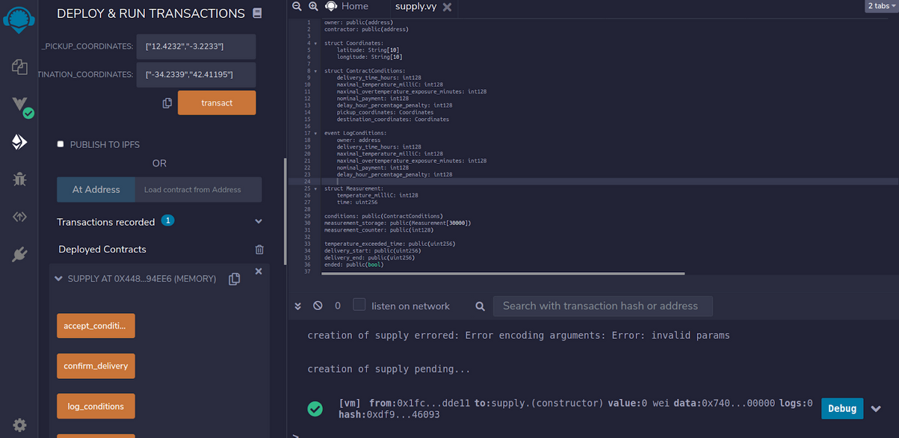
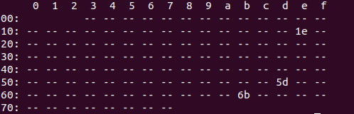

# Ratified Smart Contract for Constrained Delivery with Oraclized Data

In part I of this tutorial, we set up a private Hyperledger Besu network and configured a Raspberry Pi to sign transactions with its own keys. We used this to write a Python program, hosted on Raspberry, sending Ether to other participants of the network. The final solution used quite a broad technological stack: Terraform, Amazon Web Services, MetaMask, and, finally, Raspberry Pi. In this part, we don’t want to lower the bar so here we add some extra technological stack on the top of what we had. 

## Scenario 

Let us consider a contract between a supplier and a buyer. They both agree on some delivery time, conditions, pick up and drop off locations, and, of course - the price the buyer is willing to pay. Among the conditions, they can agree on some penalty for delayed delivery or that the parcel couldn’t be exposed to a temperature higher than some threshold longer than X minutes. While the delivery time can be verified, the monitoring of the second condition is not that easy to verify. Even if we suspect that the temperature threshold has been exceeded (because, for example, the delivered food is spoiled), how can we prove that transport conditions were inappropriate?

Here we propose an automated solution that will cover the entire supply process from publishing the delivery offer with specified conditions, accepting the conditions by contractor, starting delivery by an authorized person (using personalized hardware signature), monitoring the delivery temperature and contract voiding conditions, confirming delivery and, finally, calculating final payment for the supplier. To achieve this, we will use the Hyperledger Besu network that was deployed in the previous part of this post and write a smart contract that will handle the delivery operation.

  

## Smart contract design

To develop and deploy the smart contract we will use [Remix IDE](https://github.com/ethereum/remix-ide). We will write it with pythonic [Vyper language](https://github.com/vyperlang/vyper) and its compiler. Instead of Remix, you could use [Truffle Suite](https://www.trufflesuite.com/) instead. To better visualize the purpose of the contract we are going to develop, let us recap the functionalities it should have:

- publish smart contract to the network with specified delivery conditions
- allow contractors to accept conditions and take the contract
- start the delivery by an authorized person
- monitor temperature of the package and check voiding conditions
- finalize the delivery
- calculate the final payment for the contractor

  

  

First, you have to install both Remix and the Vyper compiler. The first one could be used either as the [web-hosted version](https://remix.ethereum.org/) or cloned from Github and deployed locally. I’m using the second option, the version with docker-compose (as in the installation guide on the repository). Vyper can be installed according to the instruction in [the documentation](https://vyper.readthedocs.io/en/latest/installing-vyper.html), and I did it using `pip`. Now, I can just type `vyper-serve` to have a locally hosted compiler.

  

  

The functions mentioned above are designed to cover the whole process, which could be extended even more by placing bids by potential contractors, requiring an authorized person to finalize the delivery, adding additional conditions (e.g., monitoring not only the temperature but also the acceleration of the package to detect too high shocks) - but this is case dependent. You should be able to extend the template we provide here to suit your needs.

**Variables in the smart contract** Expand source

```
owner: public(address)
contractor: public(address)
 
struct Coordinates:
   latitude: String[10]
   longitude: String[10]
 
struct ContractConditions:
   delivery_time_hours: int128
   maximal_temperature_milliC: int128
   maximal_overtemperature_exposure_minutes: int128
   nominal_payment: int128
   delay_hour_percentage_penalty: int128
   pickup_coordinates: Coordinates
   destination_coordinates: Coordinates
 
event LogConditions:
   owner: address
   delivery_time_hours: int128
   maximal_temperature_milliC: int128
   maximal_overtemperature_exposure_minutes: int128
   nominal_payment: int128
   delay_hour_percentage_penalty: int128
  
struct Measurement:
   temperature_milliC: int128
   time: uint256
  
conditions: public(ContractConditions)
measurement_storage: public(Measurement[30000])
measurement_counter: public(int128)
 
temperature_exceeded_time: public(uint256)
delivery_start: public(uint256)
delivery_end: public(uint256)
ended: public(bool)
voided: public(bool)
total_penalty: int128
final_payment: public(int128)
valid_approvers: constant(address[2]) = [0xafc7c956eBddcC50944047595b8857c6ACd6A7cA, 0xD253d1D2937E8FbCd0306B1b54f5607480837c2d]
```

It’s quite long, but we have to consider everything here. Just to give you an overview, we have to store addresses of the contract owner and contractor, conditions of the delivery, all the measurements and measurement counter, delivery start and end times, time for which the temperature has been exceeded, booleans stating whether the contract has been voided or has ended, total penalty for the delayed delivery and final payment for the contractor. Additionally, we have three structures: Coordinates (with geographical coordinates describing locations), ContractConditions (with all the constraints and nominal payment), and Measurement (as time-stamped temperature). There is also one event LogConditions, which is used to check the conditions of the delivery. Finally, we have a constant array with two addresses, which will be used to identify the authorized personnel.

There are also some flavors that should be explained. Note that some variables are public, and some are not (i.e., they are private). All variables that are **public have getter functions** generated automatically, which means anyone can check their values. It’s important to note that all the variables **are initialized to 0/False**. Finally, the latest version of Vyper supports the **decimal type** for floating-point operations. Unfortunately, it is not widely supported (yet) by some intermediate libraries. Therefore we stick here to the fixed-point computations.

Now we can move to functions.

**Constructor of the smart contract** Expand source

```
@external
def __init__(_delivery_time_hours: int128, _maximal_temperature_milliC: int128, _maximal_overtemperature_exposure_minutes: int128, _nominal_payment: int128, _delay_hour_percentage_penalty: int128, _pickup_coordinates: Coordinates, _destination_coordinates: Coordinates):
   self.conditions = ContractConditions({delivery_time_hours: _delivery_time_hours,
   maximal_temperature_milliC: _maximal_temperature_milliC,
   maximal_overtemperature_exposure_minutes: _maximal_overtemperature_exposure_minutes,
   nominal_payment: _nominal_payment,
   delay_hour_percentage_penalty: _delay_hour_percentage_penalty,
   pickup_coordinates: _pickup_coordinates,
   destination_coordinates: _destination_coordinates})
   self.owner = msg.sender
```

The constructor function `__init__` is fired at the moment of contract deployment. It means that we have to provide all its parameters during its deployment. Note that there is a particular variable `msg.sender` - it gets the address of the transaction’s sender account. Once we have the conditions set, we should give the possibility to check them and to accept them as a contractor. The first one takes advantage of the event that we have created earlier and will show the conditions as a log. Function `accept_conditions` simply assigns the address that triggered this function to a contractor role. 

**Functions related to the conditions of the contract** Expand source

```
@external
def accept_conditions():
   self.contractor = msg.sender
  
@external
def log_conditions():
   log LogConditions(self.owner,
   self.conditions.delivery_time_hours,
   self.conditions.maximal_temperature_milliC,
   self.conditions.maximal_overtemperature_exposure_minutes,
   self.conditions.nominal_payment,
   self.conditions.delay_hour_percentage_penalty)
```

Once a contractor accepts our conditions, we are all set and can proceed with the delivery. Once the package is picked up, one of the authorized persons should trigger the `start_delivery` function.

**Start delivery function** Expand source

```
@external
def start_delivery():
   assert msg.sender in valid_approvers
   self.delivery_start = block.timestamp
```

Note that the sender of the transaction must be in the list of valid approvers (i.e., be authorized) in order to start the delivery. Otherwise, the transaction fails, and the delivery cannot be started. Starting the delivery here is limited to setting the adequate variable to `block.timestamp`, which contains the block creation time. Note that if the function fails or has not been executed, the `delivery_start` variable is 0.

Alright, the delivery has started, what’s next? The cherry on the cake - condition monitoring. The code with the functions used here is listed below:

**Measurements storage and voiding check** Expand source

```
@internal
def time_diff(t1: uint256, t2: uint256) -> uint256:
   return t2-t1
 
@internal
def check_contract_voiding_conditions():
   if (self.measurement_storage[self.measurement_counter-1].temperature_milliC > self.conditions.maximal_temperature_milliC):
       if (self.measurement_counter>1):
           self.temperature_exceeded_time += self.time_diff(self.measurement_storage[self.measurement_counter-2].time, self.measurement_storage[self.measurement_counter-1].time)
       else:
           self.temperature_exceeded_time = self.time_diff(self.delivery_start, self.measurement_storage[0].time)
       if (self.temperature_exceeded_time > convert(self.conditions.maximal_overtemperature_exposure_minutes*60, uint256)):
           self.voided = True
           self.ended = True
   else:
       self.temperature_exceeded_time = 0
      
@external
def store_measurements(_temperature: int128, _measurement_time: uint256):
   assert not self.ended
   assert self.delivery_start > 0
   assert _measurement_time >= self.delivery_start, "Measurement time must be greater than the delivery start time"
   self.measurement_storage[self.measurement_counter] = Measurement({
       temperature_milliC: _temperature,
       time: _measurement_time
   })
   self.measurement_counter += 1
   self.check_contract_voiding_conditions()
```

Here we have three functions, and two of them have the decorator `@internal` (and, so far, all the functions were marked as `@external`). Why’s that? Internal functions can be called only from another function inside the same contract, while external ones can be called by anyone. So let’s get through them. The first one is a simple utility function returning time difference between two timestamps and is used to increase the readability of the code. The second function is used to check whether the contract should be voided. It calculates the time for which the temperature threshold has been exceeded. If that time is longer than the maximal allowable exposition period, the contract is voided. The status of the variable denoting whether the delivery has ended is set to true. Note that the final payment is not changed here and is set to 0, which means that the contractor gets nothing for such delivery, as the delivered goods should be thrown away.

But to decide whether conditions were violated or not, we need some measurements, and that’s why we have the third function here: `store_measurements`. First, we have three assert statements to assure that contract has not ended yet, that the delivery has started, and that the measurements were collected after the delivery has begun. Then, subsequent measurements are added to the measurement storage we’ve declared earlier. At the end of each execution, the counter of the measurements is incremented, and contract voiding conditions are checked.

Assuming that the conditions of the delivery were as they should be, we need functions to finalize the delivery (saying that the package arrived at the destination point) and calculate the final payment for the contractor.

**Contract finalization** Expand source

```
@internal
def finalize_contract():
   assert not self.ended
   delivery_duration: uint256 = self.time_diff(self.delivery_start, self.delivery_end)
   delivery_delay: int128 = convert(delivery_duration, int128) - self.conditions.delivery_time_hours*60*60
   if (delivery_delay > 0):
       self.total_penalty = self.conditions.delay_hour_percentage_penalty*(delivery_delay/60/60)
       if (self.total_penalty > 100):
           self.final_payment = 0
       else:
           self.final_payment = self.conditions.nominal_payment*(100-self.total_penalty)/100
   else:
       self.final_payment = self.conditions.nominal_payment
   self.ended = True
 
@external
def confirm_delivery():
   assert not self.voided, "The contract was voided!"
   self.delivery_end = block.timestamp
   self.finalize_contract()
```

Again, we have one internal and one external function. The internal one is used to calculate the total penalty for the delayed delivery. If the package arrives on time, the penalty is zero, and the final payment is the same as the nominal payment included in the delivery conditions. If the delivery is delayed, the penalty is proportional to full hours of delay, and the final payment is decreased accordingly (no more than to 0). The second function is called once the package is delivered, and we check if the contract has not been voided (just in case). Here we could also add checking whether the sender is authorized to confirm the delivery.

That’s it. We have everything we need to set up, monitor, and control the delivery. To make it shine, however, we also need the hardware layer, which will be responsible for both signing the transactions using hardware signature and measuring the temperature.

> [!INFO]
> Note also that every operation on Ethereum-based network costs gas. We are aware of it, and you should be too. Nevertheless, this shows the advantage of private networks. Ether here has no real value, so we can spend it freely without losing actual money as our network is configured to have free gas. But let’s not forget that the calculations have to be executed somewhere, so computational complexity is another limitation to keep in mind.

  

## Test deployment

Before moving to the hardware part, it’s a good idea to play with your contract on a test infrastructure a bit. You can use Remix to deploy and run transactions. Once it’s compiled, go to “Deploy & Run” on the left panel, and then you should see some parameters that can be configured. You can use JavaScript VM to deploy a test contract. Under the “deploy” field, fill all the conditions of the contract, and click “transact.”  In a while you should see a screen similar to that below:



On the left-hand side, under “Deployed contracts”, you’ll see all the external functions and public variables from the contract. By clicking them, you can either call functions or check the values of the variables. Here, you have a sandbox environment for interacting with your smart contract to fine-tune what you need.

## Hardware signature

  

Let’s get to the hardware. First of all, we’ll need a smart card that will keep our private keys safe and an NFC reader. As the smart card we’ll use [Blockchain Security 2 Go](https://github.com/Infineon/Blockchain) and [uTrust 4701 F as the](https://www.identiv.com/products/logical-access-control/smart-card-readers/contact/4701f/)  NFC reader. The card comes with python library, which we have used to develop [Ethereum transaction signer, available on Github](https://github.com/rexs-io/blocksec2go-ethereum). We’ll use it as a module in our python script. First, we need to download the dependencies: `blocksec2go` and `ecdsa`, so we’ll use `pip` to do it. Note that we’ll be building our application on the top of what we had in the first part of this article, so I assume that you already have `web3` and `python-dotenv` packages. 

After installing the `blocksec2go-ethereum` module, you should be able to use your card to sign the transactions and send them through web3 to the blockchain. You can try it out using one of the examples from the repository. The problem is that the Hyperledger Besu we have implements PoA consensus, requiring the `extraData` field to be at most 32 bytes, which is not supported natively by blocksec2go module. Therefore, on top of it we have to write our own code, encoding the signed transactions, which (saved as `security2go.py`) you can find here:  

**Customized hardware signer library** Expand source

```
import logging
import time
import blocksec2go
from blocksec2go.comm.pyscard import open_pyscard
from eth_account._utils.transactions import (
    encode_transaction,
    serializable_unsigned_transaction_from_dict
)

import web3_utils


class Security2GoSigner:
    def __init__(self, key_id):
        self.reader = None
        self.key_id = key_id
        self.logger = logging.getLogger('security2go')
        self.pub_key = None
        self._init()

    def _init(self):
        while self.reader is None:
            try:
                self.reader = open_pyscard()
            except Exception as details:
                self.logger.debug(details)
                if "No reader found" != str(details) and "No card on reader" != str(details):
                    self.logger.error(details)
                    raise Exception(f"Reader error: {details}")
                self.logger.info('Reader or card not found. Retrying in 1 second...')
                time.sleep(1)

        blocksec2go.select_app(self.reader)
        self.pub_key = self._get_pub_key()
        self.logger.info('Initialized security2go')

    def get_address(self):
        return web3_utils.address_from_public_key(self.pub_key)

    def sign_transaction(self, raw_transaction, chain_id):
        transaction = serializable_unsigned_transaction_from_dict(raw_transaction)
        transaction_hash = transaction.hash()
        self.logger.debug(f'Signing transaction with hash {transaction_hash.hex()}')
        signature = self._generate_signature_der(transaction_hash)

        r, s = web3_utils.sigdecode_der(signature)
        v = web3_utils.get_v(r, s, transaction_hash, self.pub_key, chain_id)
        encoded_transaction = encode_transaction(transaction, vrs=(v, r, s))

        return encoded_transaction

    def _generate_signature_der(self, data):
        _, _, signature = blocksec2go.generate_signature(
            self.reader, self.key_id, data
        )
        self.logger.debug('generated signature')
        return signature

    def _get_pub_key(self):
        _, _, pub_key = blocksec2go.get_key_info(self.reader, self.key_id)
        self.logger.debug('read public key')
        return pub_key[1:]  # remove the '0x04' prefix
```

To supplement the above, we need also customized web3 utils module (named `web3_utils.py`), which you can find here:

**Customized web3 utils** Expand source

```
import ecdsa
from web3 import Web3

generator = ecdsa.SECP256k1.generator

def sigdecode_der(sig):
    n = generator.order()
    return ecdsa.util.sigdecode_der(sig, n)


def find_recovery_id(r, s, hash, pub_key):
    vk = ecdsa.VerifyingKey.from_string(pub_key, curve=ecdsa.SECP256k1)
    sig = ecdsa.ecdsa.Signature(r, s)
    hash_number = ecdsa.util.string_to_number(hash)
    public_keys = sig.recover_public_keys(hash_number, generator)
    vk_point = vk.pubkey.point
    if public_keys[0].point == vk_point:
        return 0
    elif public_keys[1].point == vk_point:
        return 1
    return None


def address_from_public_key(public_key):
    pk_hash = Web3.keccak(public_key)
    address_bytes = pk_hash[-20:]
    address = address_bytes.hex()
    return Web3.toChecksumAddress(address)


def get_v(r, s, unsigned_transaction_hash, pub_key, chain_id):
    recovery_id = find_recovery_id(r, s, unsigned_transaction_hash, pub_key)
    return 35 + recovery_id + (chain_id * 2)


def sign_and_send_transaction(web3, signer, address, raw_transaction, nonce):
    raw_transaction["nonce"] = nonce
    if 'from' in raw_transaction:
        del raw_transaction['from']

    chain_id = web3.eth.chainId
    signed_transaction = signer.sign_transaction(
        raw_transaction, chain_id
    )

    tx_hash = web3.eth.sendRawTransaction(signed_transaction)

    return tx_hash.hex()


```

## Temperature sensor

As the temperature sensor, we’ll use [Altimu-10 v5 module](https://www.pololu.com/product/2739) (which, in fact, is an IMU module that happened to have a temperature sensor), but any other temperature sensor will be fine. We’ll use the I2C interface to get the temperature so, in order to get it working, we have to enable this interface on the raspberry pi first. To do it, we can enter `raspi-config` command, and in the “interfaces” menu, enable interface I2C. We’ll also need `i2c-tools` to see if everything is connected properly, which can be installed with `sudo apt install i2c-tools`. Once you have it, type `i2cdetect -y 1` (if you connected to the I2C interface labeled as 1, otherwise substitute “1” accordingly), and you should see addresses of I2C-enabled devices



In our case we have three devices on the Altimu module: LSM6DS33 (accelerometer and gyroscope) with address `0x6b` (`1101011b`), LIS3MDL (magnetometer) with address `0x1e` (`0011110b`), and LPS25H (barometer) with address `0x5d` (`1011101b`). We’ll use the first one only, but, as you can see, the possibilities are broader than just temperature measurements.

To use I2C from the python level, we’ll use the [pigpio library](http://abyz.me.uk/rpi/pigpio/), which can be installed using `sudo apt install pigpio python-pigpio python3-pigpio`. Here’s the complete code with a class for management of Altimu module:

**Altimu class** Expand source

```
import pigpio
 
class Altimu:
 
   def __init__(self, port=1, i2c_address=0x6b): #default values for altimu
       self.pi = pigpio.pi()
       self.h = self.pi.i2c_open(port, i2c_address)
 
   def configure(self):
       self.pi.i2c_write_byte_data(self.h, 0x10, 0x80)
       self.pi.i2c_write_byte_data(self.h, 0x11, 0x58)
 
   def read_temperature(self, rounded=True):
       temp_l = self.pi.i2c_read_byte_data(self.h, 0x20)
       temp_h = self.pi.i2c_read_byte_data(self.h, 0x21)
       temp = self.complement(temp_l, temp_h, 16)
       if rounded:
           return round(25.0 + temp / 16.0, 1)
       return 25.0 + temp / 16.0
      
   def close_connection(self):
       self.pi.i2c_close(self.h)
 
   def complement(self, lower, higher, bits):
       temp = lower + (higher<<8)
       if temp > (2**(bits - 1)):
           temp = temp - (2**bits)       
       return temp  
```

In the constructor, we have to open the I2C port first. Then, we have to send the appropriate configuration to the module through the `configure` function. Finally, we have the function for reading the temperature. Since the module stores the temperature on two bytes and the value should be converted to two’s complement, we have to process it accordingly. Finally, we convert it to the temperature in Celsius degrees by dividing the value by 16 and adding an offset with value 25 (which is taken from the documentation). 

Remember that you have to have the pigpio deamon running in the background. It can be turned on by typing `sudo pigpiod` in the terminal.

## Showtime

Here you can see, how the hardware setup looks like:


Now, we have to put all the parts together and see how it works. We’ll extend our API from part I by the contract manager and altimu classes. You can find the complete code below:

**Python code for starting the delivery and sending the measurements** Expand source

```
import json
from dotenv import load_dotenv
from security2go import Security2GoSigner
from web3.auto import w3
from web3_utils import sign_and_send_transaction
from eth_account import Account
from altimu import Altimu
import time
import os

class EnvironmentManager:
    def __init__(self):
        load_dotenv()

    def getenv_or_raise(self, key):
        value = os.getenv(key)
        if value is None:
            raise Exception(f'{key} variable not found in the env')
        return value

class ContractManager:

    def __init__(self, w3, envman):
        with open('abi.json') as f:
            abi = json.load(f)
            contract_address = env_manager.getenv_or_raise('CONTRACT_ADDRESS')
            self.contract = w3.eth.contract(address=contract_address, abi=abi)

    def get_contract(self):
        return self.contract

    def get_start_delivery(self):
        return self.contract.get_function_by_name('start_delivery')

    def get_contractor(self):
        contractor_func = self.contract.get_function_by_name('contractor')
        return contractor_func().call()
    
    def get_final_payment(self):
        payment_func = self.contract.get_function_by_name('final_payment')
        return payment_func().call()
    
    def has_ended(self):
        ended_func = self.contract.get_function_by_name('ended')
        return ended_func().call()

    def get_store_measurements(self):
        return self.contract.get_function_by_name('store_measurements')

    def start_delivery(self, signer, w3):
        start_func = self.get_start_delivery()
        tx = signer.sign_send_and_wait(start_func, w3)
        print("Delivery started, hash:", tx)

    def store_measurements(self, value, time, signer, w3):
        store_func = self.get_store_measurements()
        tx = signer.sign_send_and_wait(store_func, w3, value, time)
        print("Delivery started, hash:", tx)
    
class Signer:

    def __init__(self, key_id=1):
        self.signer = Security2GoSigner(key_id=1)
        self.address = self.signer.get_address()

    def sign_send_and_wait(self, func, w3, value=None, time=None):
        nonce = w3.eth.getTransactionCount(self.address)
        if(value is None):
            raw_tx = func().buildTransaction({'nonce': nonce, 'gasPrice': 0, 'gas': 210000, 'from': self.address})
        else:
            raw_tx = func(value, time).buildTransaction({'nonce': nonce, 'gasPrice': 0, 'gas': 210000, 'from': self.address})
        tx = sign_and_send_transaction(w3, self.signer, self.address, raw_tx, nonce)
        w3.eth.waitForTransactionReceipt(tx)
        return tx

env_manager = EnvironmentManager()
signer = Signer()

if not w3.isConnected():
    raise Exception(f'web3 connection failed')

alt = Altimu()
alt.configure()

contract_manager = ContractManager(w3, env_manager)

while contract_manager.get_contractor() == '0x0000000000000000000000000000000000000000':
    print("Waiting for a contractor to accept the conditions")
    time.sleep(10.0)

contract_manager.start_delivery(signer, w3)

while not contract_manager.has_ended():
    now = int(time.time())
    x = int(alt.read_temperature()*1000)
    print("Temperature:", x, "Time:", now)
    contract_manager.store_measurements(x, now, signer, w3)
    time.sleep(10.0)

print("The delivery has ended, final payment:", contract_manager.get_final_payment())
alt.close_connection()
```

Note that we have added a new field in the file with the environmental variable: `CONTRACT_ADDRESS` in `.env` file, which is the address where the contract is deployed. We have to create also a new file “abi.json” containing the Application Binary Interface (ABI) of our contract (which we can copy from Remix).  

Once the contract is deployed on our Besu network, the program can be started. First, it waits until a contractor accepts the delivery conditions. When it's done, it starts the delivery (requiring the use of the smart card) and continuously sends the subsequent temperature measurements to the contract. Once the contract is finished (which happens outside the program), we’ll not be able to send the measurements anymore, and the final payment will be shown along with the information about the fact that delivery has ended. This gives us the possibility to close the I2C connection with the sensing module.  

Right now all the measurements are configured to be signed by the smart card, but you can easily change it by substituting the signer of a transaction to the one from part I. However since we are using hardware-signed transaction to notarize the measurement data, we have Raspberry Pi configured as a data oracle.

  

## Summary

We have shown a full stack that can be useful while integrating enterprise blockchain solutions, based on the Hyperledger Besu, with IoT devices. To add some flavor to our development, we have also shown a smart contract designed and developed for a specific use case, where, in turn, we’ve injected measurements from temperature sensors. We have also included a smart card to sign the transactions to be sure that only authorized persons could trigger some functionality of the smart contract. Nevertheless, it was a very concrete use case, and it was only the tip of the iceberg. There’s much more, and the possibilities are endless. We hope that this tutorial will give you the thrill to build your own blockchain application.

If you have any questions, feel free to contact us!

[Krzysztof Radecki](mailto:krzysztof.radecki@rexs.io), CEO at [rexs.io](https://rexs.io)  
[Marek Tatara](mailto:marek.tatara@dac.digital), R&D Projects Coordinator at [DAC.digital](https://dac.digital)

## Related articles

Error rendering macro 'contentbylabel' : CQL was parsed but the search manager was unable to execute the search. Error message: com.atlassian.confluence.api.service.exceptions.scale.SSStatusCodeException: There was an illegal request passed to XP-Search Aggregator API : HTTP/1.1 403 Forbidden