# 2024 - Besu Performance Improvements since the Merge

- [Introduction](#introduction)
- [Besu block processing performance Profile](#besu-block-processing-performance-profile)
- [Besu performance improvements](#besu-performance-improvements)
  - [Transaction processing improvements](#transaction-processing-improvements)
    - [SLOAD operation improvements](#sload-operation-improvements)
    - [SSTORE operation improvements](#sstore-operation-improvements)
  - [General EVM improvements](#general-evm-improvements)
    - [EVM Benchmarking](#evm-benchmarking)
    - [Native Types Transition](#native-types-transition)
    - [Inline EVM Operations Loop](#inline-evm-operations-loop)
    - [Security-related Optimizations](#security-related-optimizations)
  - [Commit phase improvements](#commit-phase-improvements)
  - [Persist phase improvements](#persist-phase-improvements)
- [Besu resources optimizations](#besu-resources-optimizations)
  - [Memory usage optimizations :](#memory-usage-optimizations)
- [What is the optimal Besu configuration for maximizing performance and minimizing resource usage?](#what-is-the-optimal-besu-configuration-for-maximizing-performance-and-minimizing-resource-usage)
- [Future work around performance](#future-work-around-performance)

# Introduction

Operating as an execution layer (EL) client, Besu is responsible for validating and executing each block sent by the consensus layer (CL) client every Slot (12 seconds). Fast and effective block execution and validation are key roles of an EL. Moreover, there's a window of 1/3 \* SECONDS\_PER\_SLOT (4 seconds) at the start of each slot for each validator to offer their local chain perspective, and [attest](https://besu.hyperledger.org/23.4.0/public-networks/concepts/proof-of-stake/attestations), once per Epoch (6.4 minutes). In essence, the validating node (CL+EL) has a 4-second interval from the slot's beginning to receive the block (gossip time), validate and execute each separate transaction on the EL, and confirm the correct head on the CL side. As such, the faster the EL can execute the block, the better, since some blocks may arrive late, even after 3.5 seconds from the slot's start, requiring the EL to execute the block as quickly as possible to earn the full attestation reward. It's important to highlight that about 85% of validators' rewards come from making attestations. With these considerations in mind, this article will focus on Besu's improvements to block processing performance.

We're eager to share that since the merge in September 2022, Besu team improved Block processing performance by **three times** reaching a **95th percentile around 250 ms and 99th percentile around 500 ms** on a solo staking hardware machine (AMD Ryzen 5 5600G, 32 GB DDR4 3200MHz, 2TB WD Black SN850 NVMe).

A TL;DR is provided towards the bottom with our recommended staking configuration.

# Besu block processing performance Profile

To boost a client's performance, it's essential to collect metrics, evaluate the existing state, and then plan enhancements based on these insights. Extra data is also needed to identify which parts of the code consume the most time during the program's execution. Besu offers a plethora of metrics covering different facets of the execution layer, including block processing (newPayload calls), p2p, RPC, the transaction pool, syncing, the database layer (RocksDB), among others. These metrics can be gathered or extracted by any monitoring system like Prometheus and can be displayed using a visualization tool such as Grafana with the existing [Besu Full dashboard](https://grafana.com/grafana/dashboards/16455-besu-full/). 

To identify the components that take up the most processing time, we need to collect more data through profiling. While Besu doesn't support continuous profiling, we typically perform profiling whenever we undertake performance improvement tasks after metrics collection. Given that Besu is a Java application, there are different profilers available that use code instrumentation, sampling, or a combination of both. We have employed various profilers on Besu and have consistently obtained reliable results concerning the Block processing performance profile. When conducting performance analysis, it's crucial to utilize a variety of tools to ensure no aspect is overlooked, given that each tool has its unique method of recording data, a chosen frequency, and so on.

**Profiling with Dynatrace (instrumentation + sampling)**

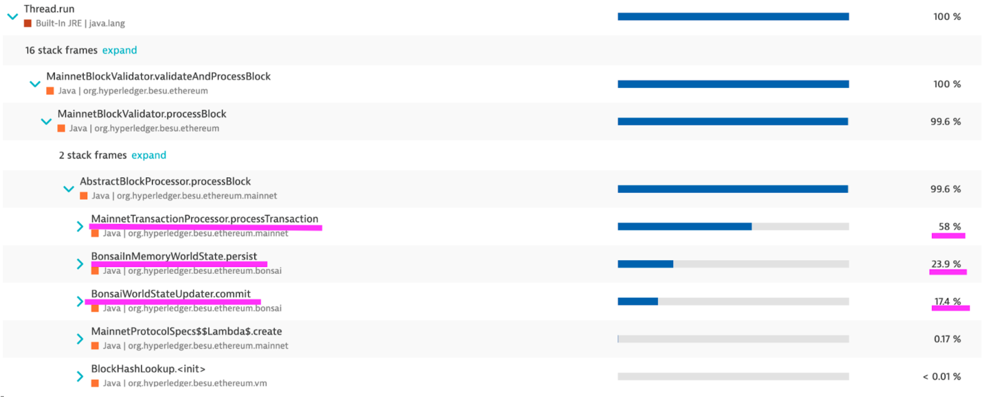

**Profiling with Yourkit (sampling)**

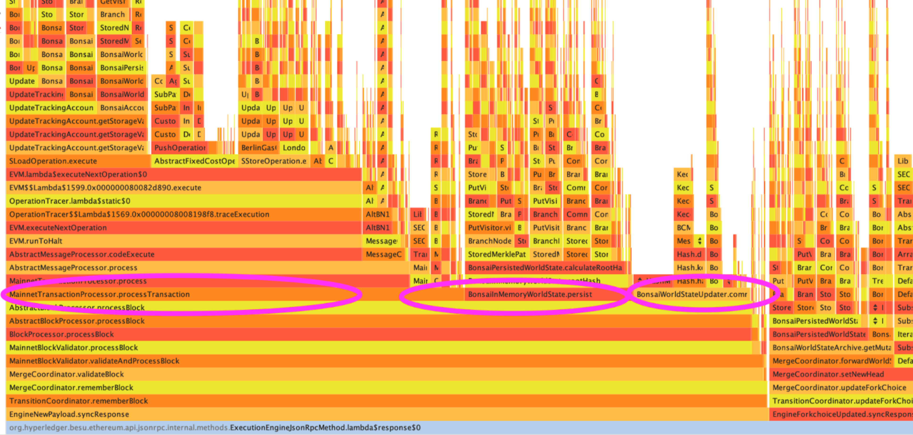

**Profiling with Async Profiler (sampling)**

From the outcomes of the three distinct tools, we can infer the block processing performance profile, which has three primary time-consuming components :

1. Transactions processing, especially **SLOAD** operation
2. Commit the changes to the world state accumulator
3. Persist the changes in memory and calculate the new root hash

It was crucial to establish this baseline and focus on each of these primary time-consuming components to decrease the overall time required for block processing. As we'll explore in the following section, each enhancement is associated with one of these three main components.

# Besu performance improvements 

Since the merge in September 2022, we've been committed to improving Besu's block processing performance, following a significant number of user reports about missing attestations on their validators. We've succeeded in boosting the performance **by three times**, lowering the median time **from 1.71 seconds to 0.49 seconds** on the m6a.xlarge AWS VM, and the 95th percentile **from 2.98 seconds to 0.81 seconds.** It's important to note that the m6a.xlarge AWS instance comes with 4vCPU, 16 GiB, and lacks NVMe. Most of the improvements have been made specifically to the Bonsai data layer implementation. If you're using Besu with Forest and experiencing performance problems, we suggest switching to Bonsai.

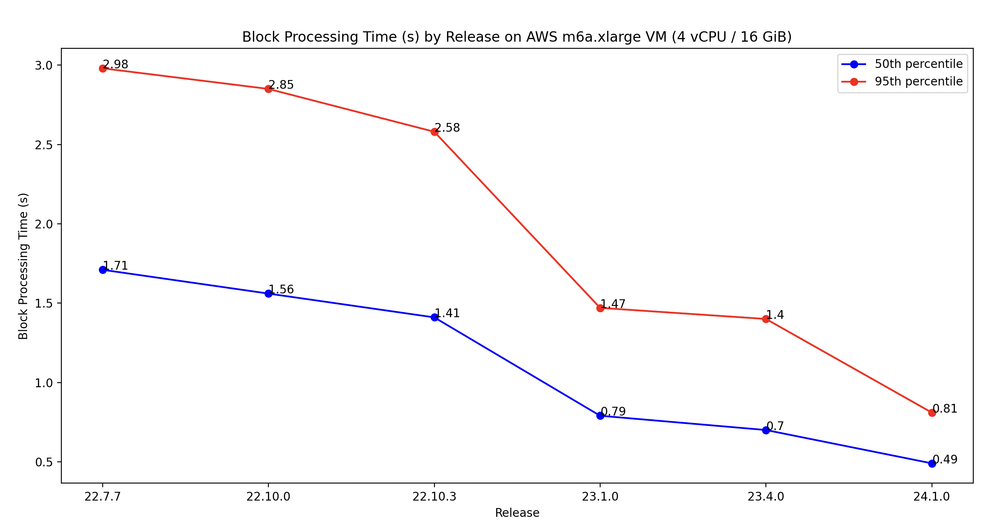

On better instances, such as the mid-spec VM on Azure Standard\_D8as\_v5 (8 vCPU, 32 GiB with a remote SSD disk), Besu's performance is even better. As shown in the screenshot below, both instances exhibit a **median time of approximately 250 milliseconds** and a **95th percentile around 410 milliseconds.**

**50th percentile on Standard\_D8as\_v5 Azure VM**

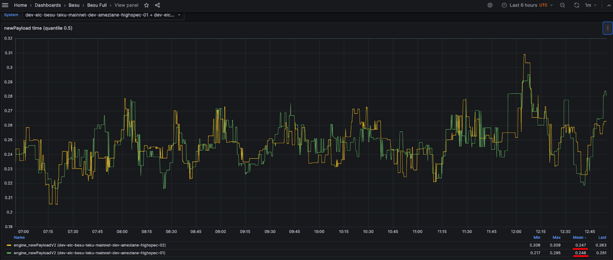

**95th percentile on Standard\_D8as\_v5 Azure VM**

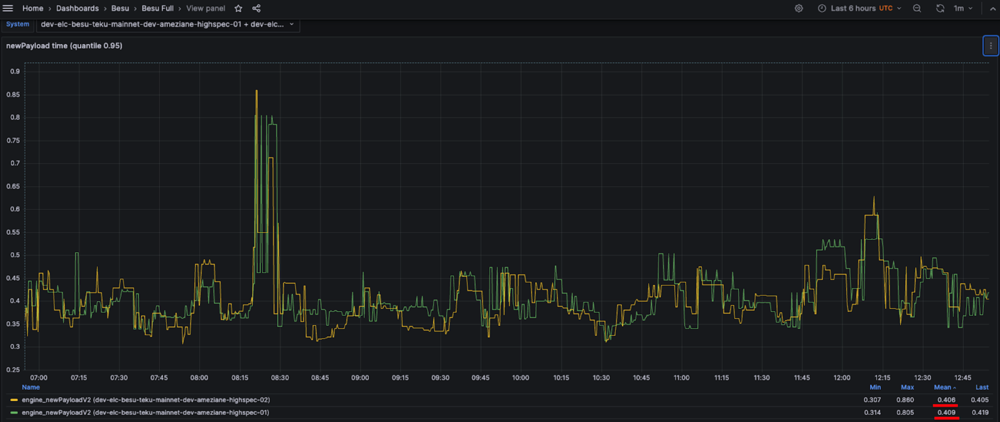

These performances were achieved with Bonsai, Snap Sync, the flat database healing flag enabled (***\--Xsnapsync-synchronizer-flat-db-healing-enabled=true***) and the high spec flag enabled (***\--Xplugin-rocksdb-high-spec-enabled***).

Having observed the outcomes of the improvements, let's now delve into the various optimizations that have been implemented.

## Transaction processing improvements

Post-merge, the most time-consuming components in transaction processing were the SLOAD and SSTORE operations, so our initial focus was on optimizing these operations. These operations were particularly Disk IO intensive due to the large number of calls made to the database layer (RocksDB). Therefore, the majority of our optimization efforts were aimed at reducing the frequency of Besu's database calls.

### SLOAD operation improvements 

One of the biggest improvements on SLOAD operation was the implementation of the [healing mechanism of the Bonsai flat database](https://hackmd.io/@kt2am/ryrH0APG6) on accounts and storage. [Bonsai](https://besu.hyperledger.org/23.10.2/public-networks/concepts/data-storage-formats#bonsai-tries) is a feature in the Besu Ethereum client that operates with both a flat database and a trie structure simultaneously. This unique combination allows for faster and more efficient SLOAD operations.

In a traditional trie structure, the accounts and slots are located at the bottom of the trie (leaf). To find a specific account or slot, you have to go through the entire trie. Every time we go through a node in the trie, it corresponds to a read operation in the database. The deeper the information is in the trie, the more reads are needed, which can slow down the operation.

The introduction of a flat database structure alongside the trie in Bonsai presents a significant advantage. Instead of going through the entire trie, the leaves (accounts and slots) are directly accessible. This means that you can find any information with a single read in the database, no matter its “depth” in the trie. This makes the search process much faster and more efficient. There was still a performance issue as at the end of the sync, the Bonsai flat database for accounts and storage wasn’t complete, due to the change of the pivot block during snap sync or fast sync. The healing mechanism of the flat database was implemented to make the flat database complete at the end of the sync. **This improved the block processing performance by 20%.**

As shown in the profiling below, there's a significant difference when running Besu with a complete flat database compared to running it without one. The SLOAD operation execution time is improved but also all the other operations that need to access either the storage slots or the accounts data. The flat database healing flag can be enabled with ***\--Xsnapsync-synchronizer-flat-db-healing-enabled=true*** Besu option.

**Besu running without a complete flat database**

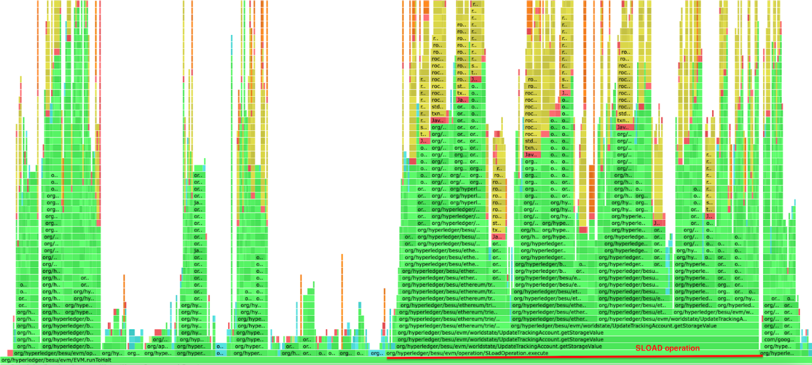

**Besu running with a complete flat database**

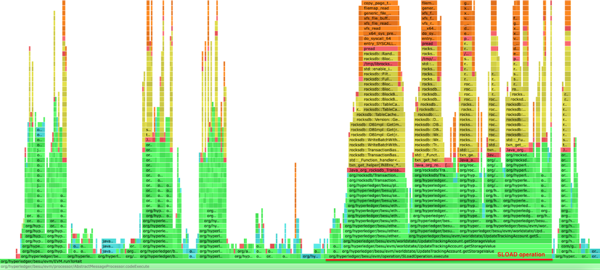

Another improvement we introduced was turning off checksum verification during reads on RocksDB. This is because there are already different validations in place as per the Ethereum client specifications. To make this flag working, which it wasn't initially, the Besu team had to contribute to the RocksDB project through [this PR](https://github.com/facebook/rocksdb/pull/11099).

We also focused on fine-tuning RocksDB by activating the [bloom filters](https://en.wikipedia.org/wiki/Bloom_filter). When a read request comes in, RocksDB uses the Bloom filter to check if the key is present in an SST (Sorted String Table) file without having to scan the entire file, this helps to speed up read operations. Additionally, we introduced a new flag for high-spec machines (with RAM > 16 GiB) to utilize more block cache, thereby reducing IO activity during SLOAD. The high spec flag can be enabled with this Besu option ***\--Xplugin-rocksdb-high-spec-enabled.***

Besu has also benefited from the updates and [releases of RocksDB](https://github.com/facebook/rocksdb/releases), which have led to enhancements in performance.

### SSTORE operation improvements

A lot of the time spent on the SSTORE operation is used to figure out the storage gas cost and the refund amount. This is done by looking at the current value, the original value, and the new one. This entire algorithm is outlined in the original [EIP-1283](https://github.com/ethereum/EIPs/blob/master/EIPS/eip-1283.md).

The first improvement we made was to only retrieve the current and original values once, and then use them for both calculations (storage gas cost and refund).

The second improvement involved caching empty slots in the Bonsai accumulator. This optimization positively impacted both SLOAD and SSTORE operations. However, the improvement was more noticeable in SSTORE operations, as some of the original and current values can be empty. This PR had a huge impact on SSTORE execution performance as we can see in the CPU profiling below

**Before the optimization**

**After the optimization**

## General EVM improvements 

In addition, the Besu team has continued to work on enhancing the overall performance of the EVM. Engineering efforts from Hedera have focused mostly on non-storage related EVM performance. Most of these performance improvements came from re-writing core portions of the EVM with performance in mind instead of using idiomatic Java patterns.

### EVM Benchmarking

Improving performance without a consistent reference is akin to wandering in the desert at night: given enough time and space you will  wind up where you started. A simple benchmarking suite called [CartEVM (cartesian join + EVM)](https://github.com/shemnon/cartevm) was written.  For every operation it creates a state test that exercises the same operation as many times as possible with a minimum of other supporting operations.  Execution with large contracts, at large gas limits, and inside a profiler has provided a wealth of optimization opportunities.  Notable for CartEVM is that it can be configured to exercise all combinations of multiple opcodes exhaustively (the "cartesian join part") and that has unveiled some unexpected performance impacts.

Below is a summary table run with Java 21 on a M1 Mac Pro. Java 21 offers a 10-20% boost just for using it. Java 17 runs are more flat after 22.10.0 but are also lower than Java 21 runs in all cases.  5 runs of each operation were executed and the median and max values are shown. The results against all operations and a few select problematic values are averaged together to provide the number in this graph.  There are two notable bumps on this graph, at 22.1.0 and 22.10.0, while the work after 22.10.0 have been focused on fixing some worst-case performance scenarios.

  

### Native Types Transition

The first bump at 22.1.0 is mostly because of transitions from rich Java types for items such as `Gas` and transitioning stack items to simpler data types.  This netted out to nearly doubling non-storage gas per second of the Besu EVM.

### Inline EVM Operations Loop 

The next large bump came in 22.10.0 with the introduction of an inline operations loop.  Prior to this all operations were subclasses of a single Operation class, and the loop selected an Operation object (following the Gang of four's Strategy pattern) and then called an overloaded method to execute the operation agains the current VM state. This "megamorphic method" is a know performance problem in "hot" Java code. Java JITs work best against "monomoropic methods" where there is only one or two possible receivers per call site.

To address this dispatch problem all of the high frequency operations were unwrapped into a single large switch statement, with each case statement calling a static form of the operation. The operations could still be used as virtual objects to build a custom VM based on the old pick and execute engine. Note that not all operations were unwrapped.  More expensive and less frequently used operations didn't exhibit much performance improvement from unwrapping their dispatch into the switch.

Not hard-wiring in all operations also preserved important functionality for [Hedera](https://github.com/hashgraph/hedera-services/blob/release/0.45/hedera-node/hedera-evm/src/main/java/com/hedera/node/app/service/evm/contracts/operations/HederaEvmChainIdOperation.java), [Linea](https://github.com/Consensys/sidechains-besu/blob/2ac0be2aec08350d75178e23c1ad75bfad3510fd/evm/src/main/java/org/hyperledger/besu/evm/operation/linea/BlockHashNumberOperation.java), and other downstream users of the EVM Library. Being able to override non-performance critical operations with operations more suitable for their use case increases the utility of EVM Equivelance in non-mainnet use cases.

### Security-related Optimizations

Most of the jitter seen in the past three quarterly releases are Jitter related to worst case performance scenarios predominantly found by [Guido Vranken](https://github.com/guidovranken/el-fuzzers/issues?q=is%3Aissue+is%3Aopen+besu) (not all findings published yet). Some of the best findings have come from his work in fuzzing multiple EVM implementations and sharing the slow executing cases. While these cases are not typical in mainnet use (otherwise we would have seen them before) they could easily be used as an attack to slow down Besu nodes and in extreme cases stall networks. This work also helped fill out missing features from the [Besu EVM Fluent AIPs](https://github.com/hyperledger/besu/tree/main/evm/src/main/java/org/hyperledger/besu/evm/fluent).

## Commit phase improvements

This phase involves consolidating the changes resulting from transaction execution into certain data structures in an aggregate manner. The enhancements made during this phase aim to parallelize certain steps, thereby utilizing available CPU resources and reducing execution time.

## Persist phase improvements

A large part of the time during the persist phase was allocated to the computation of the root hash. One of the major enhancements was to asynchronously preload the trie nodes of the storage and accounts that are accessed during transaction processing, thereby preventing their retrieval during the root hash calculation. Additional improvements in this phase were designed to eliminate unnecessary operations and introduce parallelization in steps where it's possible.

# Besu resources optimizations

## Memory usage optimizations : 

In our efforts to decrease memory usage in Besu, we initially [compared various system memory allocators](https://lf-hyperledger.atlassian.net/wiki/display/BESU/Reduce+Memory+usage+by+choosing+a+different+low+level+allocator): Malloc (default), TcMalloc (Google), Mimalloc (Microsoft), and Jemalloc. Based on the metrics we gathered, we found that Jemalloc outperformed the others for Besu's workload, reducing Besu's memory usage by over 40%. This significant reduction is primarily attributed to superior memory defragmentation and enhanced multithreading. 

We also observed that setting MALLOC\_ARENA\_MAX to 1 or 2 significantly reduced the Resident memory usage. At present, when operating Besu with an official Docker image, it comes with jemalloc and MALLOC\_ARENA\_MAX set to 2. If you're running Besu natively, it will indicate whether it's using Jemalloc or if it's not installed. If Jemalloc is not installed, you will see a message in the Besu logs stating, 'jemalloc library not found, memory usage may be reduced by installing it'.

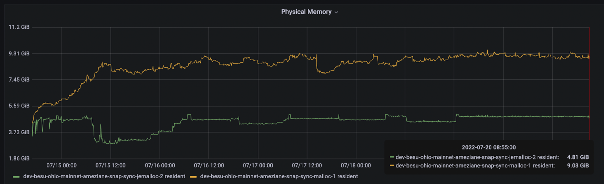

We also observed that the OpenJ9 JVM implementation exhibits a better memory footprint, primarily due to its garbage collection (GC) implementation (GenCon) which more frequently frees up memory.

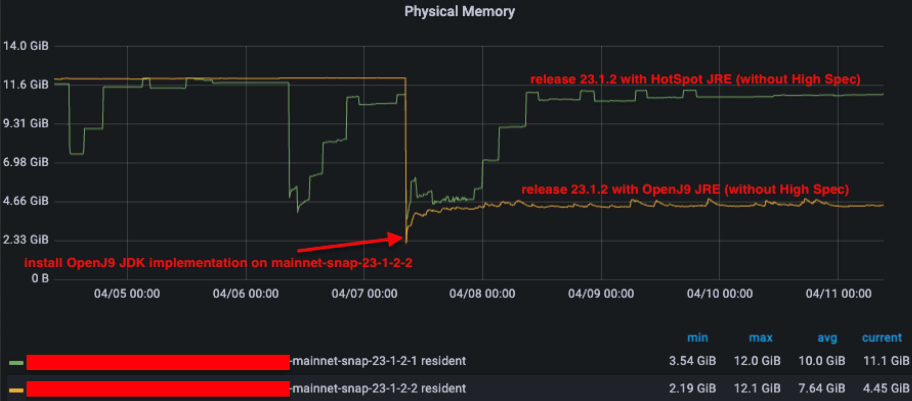

Given this behavior with OpenJ9, we opted to adjust the Garbage Collector (G1GC) of the HotSpot JVM implementation to mimic this behavior without affecting performance. We introduced three flags -XX:G1ConcRefinementThreads=2 -XX:G1HeapWastePercent=15 -XX:MaxGCPauseMillis=100, which are now incorporated into the besu.sh script, and the outcome is similar to OpenJ9 JVM implementation.

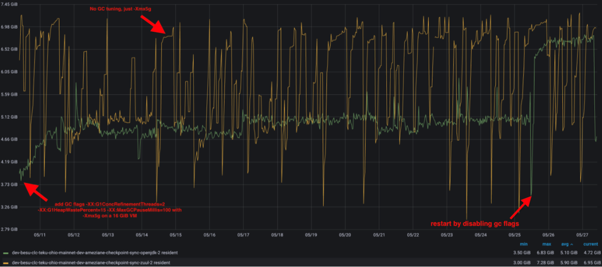

With the default JVM installed (Hotspot), users simply need to check the logs to determine if Jemalloc is installed. If it's not, we recommend installing it to reduce Besu's memory footprint.

# What is the optimal Besu configuration for maximizing performance and minimizing resource usage? 

Here is the Besu configuration recommended for a solo staker :

- Enable the flat database healing with ***\--Xsnapsync-synchronizer-flat-db-healing-enabled=true***
- Enable the high spec flag if your machine has more than 16 GiB RAM ***\--Xplugin-rocksdb-high-spec-enabled***
- Install [Jemalloc](https://github.com/jemalloc/jemalloc/blob/dev/INSTALL.md) to replace the default system allocator (malloc). Besu will automatically detect if it is installed and Preloaded as the system memory allocator.

If you need to troubleshoot performance, [check out our documentation here](https://besu.hyperledger.org/public-networks/how-to/troubleshoot/performance).

Here’re some other best practices :

- Turn off swapping to avoid slowing down calls, as it puts extra strain on the already bottlenecked Disk IO
- Opt for a high-performance SSD disk with NVMe to overcome Besu's typical slow disk I/O bottleneck. We suggest a minimum of 15,000 IOPS and 60 MiB/s bandwidth for reads, and 5,000 IOPS with 20 MiB/s bandwidth for writes. For a comprehensive overview on Ethereum staking disks, refer to [Yorick's post](https://gist.github.com/yorickdowne/f3a3e79a573bf35767cd002cc977b038#the-good). You can also use [https://ssd.userbenchmark.com/](https://ssd.userbenchmark.com/) to see your SSD performance and compare with other references. Execute the following command on your machine, specifically on the disk you wish to evaluate, to determine the actual IOPS and throughput :

  
fio --randrepeat=1 --ioengine=libaio --direct=1 --gtod\_reduce=1 --name=test --filename=test --bs=4k --iodepth=64 --size=4G --readwrite=randrw --rwmixread=75

- On SATA, the controller in UEFI/BIOS set to anything other than [AHCI](https://www.addictivetips.com/windows-tips/enable-ahci-bios/). Set it to AHCI for good performance (source : [Yorick's post](https://gist.github.com/yorickdowne/f3a3e79a573bf35767cd002cc977b038#the-good)).
- Set -Xmx to 5 GiB (-Xmx5g), higher values may improve sync time, but can be reduced after completing sync to 5 GiB.
- If you're running on ARM64, make sure the glibc version is greater than 2.29. If not, Besu uses a Java implementation instead of the native one for some precompiled contracts, which results in lower performance.
- 
  - On Ubuntu, run ldd --version. See [the methods for other environments](https://dev.to/0xbf/how-to-get-glibc-version-c-lang-26he).
- Pay attention to what processes are running on the same machine/VM as Besu. Java applications, with default settings, are designed to run alone on the machine. You can run your consensus client on the same machine, but this adds overhead on Besu, and vice versa (on CPU cache misses, CPU scheduler latency, IO, etc.).

Here are the performance metrics with recommended Besu configuration for a solo staker with the following setup:

- AMD Ryzen 5 5600G
- 32 GB DDR4 3200MHz (8GB allocated to Besu heap)
- 2TB WD Black SN850 NVMe (Teku and the OS are on a different drive)

The block processing time with recent releases

- **95th percentile around 250 ms**
- **99th percentile around 500 ms**

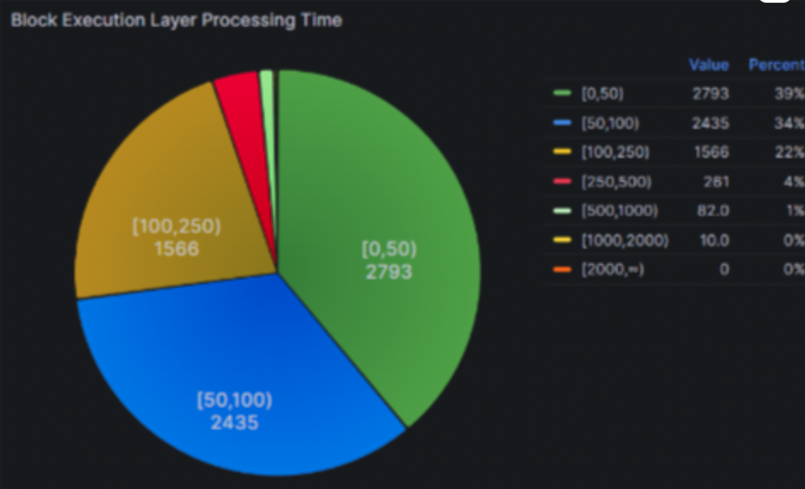

# Future work around performance

Looking ahead, our focus on performance will continue, with specific emphasis on the following areas:

1. Parallel Processing: We aim to explore ways to do more work in parallel. Given that there is a significant amount of available CPU during block processing even on low-spec hardware, we believe there is potential to increase efficiency and performance by leveraging parallel processing techniques.
2. Disk IO Optimization: We plan to investigate solutions that optimize Disk IO activity. By reducing or improving the efficiency of our disk operations, we can further enhance the performance of Besu.
3. Static Analysis: We intend to study the use of static analysis on the block to predict which slots and accounts can be preloaded. This could potentially speed up processing times and improve block processing performance.