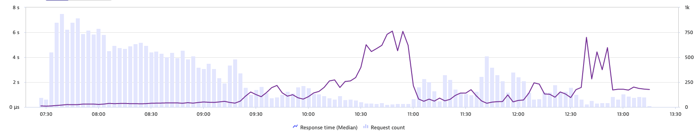
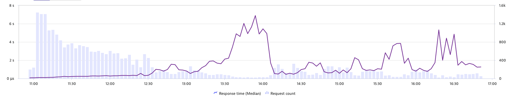
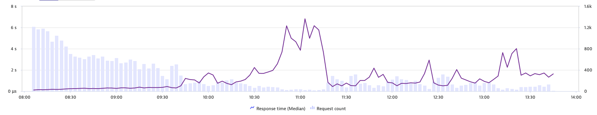

# Fast sync optimisation

> [!INFO]
> This page is a work in progress

## Environment setup

### Hardware

[AWS i3.xlarge](https://aws.amazon.com/ec2/instance-types/i3/)

### Deployment

TODO add Ansible scripts used to run this tests

## Testing process

Three distinct runs of about 32478 imports (1 import = 200 blocks) → took between 5 hours 30 minutes and 6 hours. 

### Collected data

- Median response time per 200 blocks import
- System metrics
  - CPU
  - Memory
  - Disk IO
  - Network IO
- CPU Profiling
- Memory Profiling

## Initial reference results

|     |     |     |     |     |     |     |     |
| --- | --- | --- | --- | --- | --- | --- | --- |
|     | **Global elapsed time** | **Number of imports (1 import = 200 blocks)** | **Average Response time import 200 blocks (ms)** | **Median response time import 200 blocks (ms)** | **90th percentile response time import 200 blocks (ms)** | **95th percentile response time import 200 blocks (ms)** | **Maximum response time import 200 blocks (ms)** |
| **Execution #1** | 5 hours, 55 minutes | 32478 | 632 | 294 | 1450 | 2210 | 27300 |
| **Execution #2** | 5 hours, 39 minutes | 32674 | 611 | 308 | 1350 | 2020 | 18300 |
| **Execution #3** | 5 hours, 48 minutes | 32770 | 616 | 325 | 1320 | 2010 | 27000 |

### Median response time per 200 blocks import

#### Execution #1

### 

#### Execution #2

#### Execution #3

  

## Optimisation attempts

### Attempt 1: Execute World Sate download before block Imports

#### Expected effect

TODO

#### Results

TODO

#### Decision

TODO