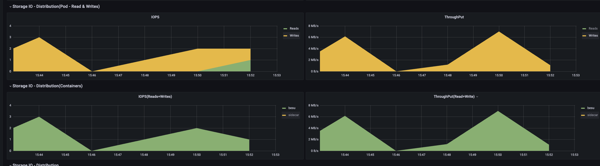
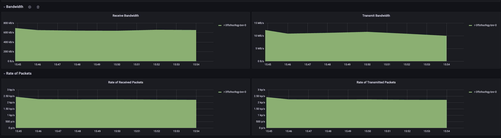
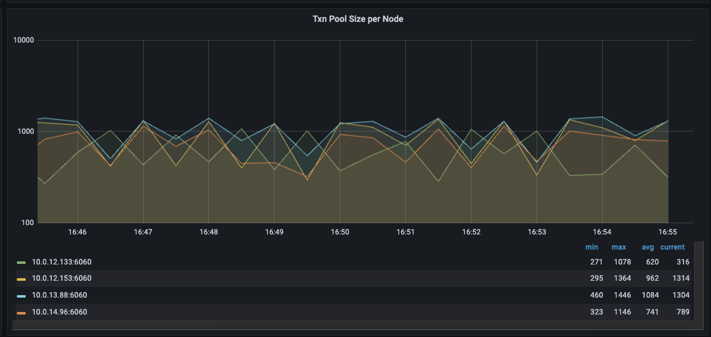
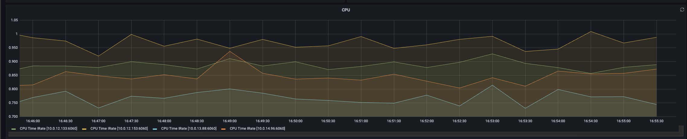
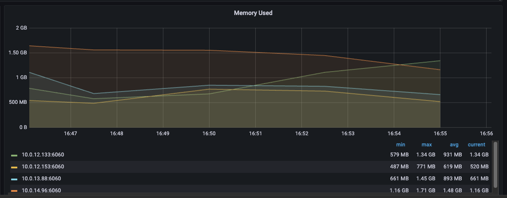

# QBFT Performance

The configuration settings below provide a consistent setup for collaboration on QBFT performance work. For ease of collaboration, all performance tests are being done using Caliper (see config below). Performance for a QBFT chain is not strictly "how fast does the chain go" or "what TPS can be achieved". A chain can peak at higher TPS's for a short period of time, but then blow its TX pool due to growth beyond the TX pool size. The results below are for continuous, stable operation. Typically this means no less than 10,000 transactions per caliper run (10k is usually enough to blow the TX pool if you push it too hard).

### 4-node QBFT chain with Forest DB

Current best results:

Caliper "open" test using caliper simple contract:

-  1 caliper connected to a single node: 750 TPS
-  2 calipers connected to individual nodes: 950 TPS
-  2 calipers connected to their own node: 1200 TPS

Caliper ERC20 token transfer test:

-  1 caliper connected to a single node: 520 TPS
-  2 calipers connected to individual nodes: 570 TPS
-  2 calipers connected to their own node: 645 TPS

  

Setup:

- 4 QBFT validators
- Configuration:
  - Env:
    - BESU\_OPTS=-XX:MaxRAMPercentage=70.0
  - CLI:
    - besu --discovery-enabled=false --Xdns-enabled=true --Xdns-update-enabled=true --min-gas-price=0 --data-path=./data --genesis-file=../genesis.json --rpc-http-api=ETH,QBFT,ADMIN,NET --rpc-ws-api=ETH,QBFT,ADMIN,NET --metrics-port=6060 --logging=INFO --rpc-http-enabled=true --rpc-ws-enabled=true --graphql-http-enabled --metrics-enabled=true --remote-connections-limit-enabled=false --tx-pool-disable-locals --tx-pool=sequenced --tx-pool-limit-by-account-percentage=0.55 --rpc-http-max-active-connections=300 --data-storage-format=FOREST **\--cache-last-blocks=32**
  - Besu start logs:  
   # Java: -ibmcorporation-eclipseopenj9vm-java-17    
   # Maximum heap size: 7.00 GB             
   # OS: linux-x86\_64        
   # glibc: 2.35             
   # jemalloc: 5.2.1-0-gea6b3e973b477b8061e0076bb257dbd7f3faa756      
   # Total memory: 30.83 GB                 
   # CPU cores: 8  
  - Pod limits/requests:
    - ```
Limits:  
 cpu:     4  
 memory:  10Gi  
Requests:  
 cpu:     2500m  
 memory:  5Gi
```
- K8S node size: 
  - m6i.2xlarge 
  - gp3 storage
  - > Capacity:
> 
>   attachable-volumes-aws-ebs:  39
> 
>   cpu:                         8
> 
>   ephemeral-storage:           104845292Ki
> 
>   hugepages-1Gi:               0
> 
>   hugepages-2Mi:               0
> 
>   memory:                      32329184Ki

Deployment:

- 4 nodes running in the same AWS AZ
- Caliper instances running on m6a.2xlarge EC2 instance in same region

Genesis file:

> {
> 
>   "alloc": {},
> 
>   "coinbase": "0x0000000000000000000000000000000000000000",
> 
>   "config": {
> 
>     "berlinBlock": 0,
> 
>     "chainId": 90001,
> 
>     "qbft": {
> 
>       "blockperiodseconds": 2,
> 
>       "epochlength": 30000,
> 
>       "requesttimeoutseconds": 10
> 
>     }
> 
>   },
> 
>   "difficulty": "0x1",
> 
>   "extraData": "0xf83aa00000000000000000000000000000000000000000000000000000000000000000d5943edcd4d1ea9fe0b8d5e438fb8e8a5d138214479ac080c0",
> 
>   "gasLimit": "0x174876e800",
> 
>   "mixhash": "0x63746963616c2062797a616e74696e65206661756c7420746f6c6572616e6365"
> 
> }

Caliper scenario (4 instances running with this config):

> test:
> 
>   name: simple
> 
>   description: >-
> 
>     This is an example benchmark for Caliper, to test the backend DLT's
> 
>     performance with simple account opening & querying transactions.
> 
>   workers:
> 
>     number: 1
> 
>   rounds:
> 
>     \- label: open
> 
>       description: >-
> 
>         Test description for the opening of an account through the deployed
> 
>         contract.
> 
>       txNumber: \*number-of-accounts
> 
>       rateControl:
> 
>         type: fixed-rate
> 
>         opts:
> 
>           tps: 750 # tps for opening the configured number of accounts
> 
>       workload:
> 
>         module: benchmarks/scenario/simple/open.js
> 
>         arguments: \*simple-args

  

### Logs

Log file for one node during a short performance run:

[node.log](./attachments/node.log)

Log file for one instance of caliper during short run. Note ~110TPS performance as there were 4 instances running. (This was actually configured with both open and transfer caliper tests):

[caliper.log](./attachments/caliper.log)

  

### Metrics

Some screenshots of metrics during a ~420TPS run

  

Storage IO for one node in the group:

  



  

Network UI for one node in the group:

  



  

TX pool size for all nodes:

  



  

CPU load for all nodes:

  



  

Memory usage for all nodes:

  



  

### Flame graphs

The following graphs were captured on 2 of the nodes using `async-profiler` with the following settings: 

\-agentpath:/opt/async-profiler/lib/libasyncProfiler.so=start,event=cpu,loop=10m,file=profile-%t.html"

These were in the middle of a 100k caliper test set to 105 TPS for each of the 4 caliper instances (totalling 420 TPS across them). Each of the 2 nodes the flame graphs were captured for had a single caliper instance connected to them.

  

[profile-20240502-190200.html](./attachments/profile-20240502-190200.html)
  [profile-20240502-190204.html](./attachments/profile-20240502-190204.html)