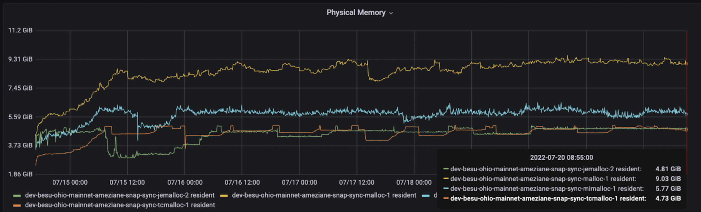
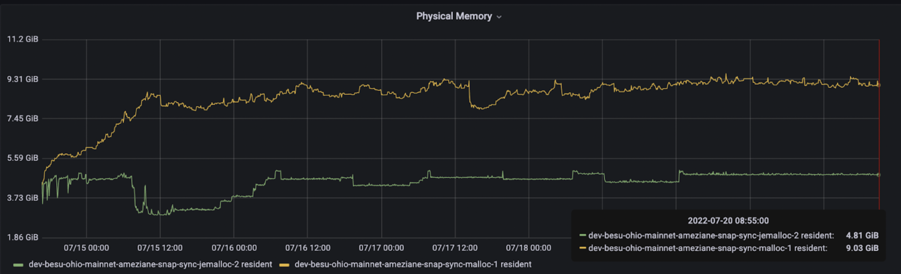
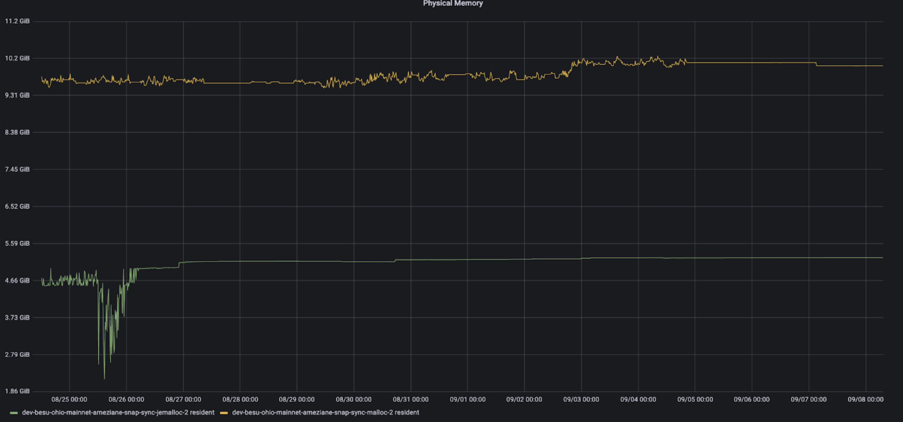
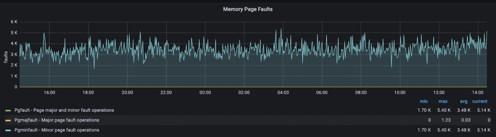
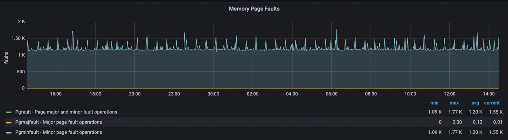
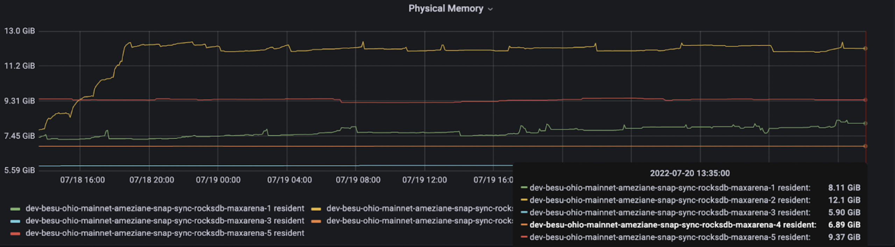

# Reduce Memory usage by choosing a different low level allocator

- [Introduction](#introduction)
- [The test setup](#the-test-setup)
- [The metrics](#the-metrics)
  - [Malloc vs TcMalloc vs Jemalloc vs Mimalloc](#malloc-vs-tcmalloc-vs-jemalloc-vs-mimalloc)
  - [Malloc vs JeMalloc](#malloc-vs-jemalloc)
    - [Resident memory utilization](#resident-memory-utilization)
    - [Memory page faults](#memory-page-faults)
  - [Test different values for MALLOC\_ARENA\_MAX](#test-different-values-for-malloc_arena_max)
- [Conclusion](#conclusion)

# Introduction

We came across an interesting feedback around RocksDB memory consumption regarding the used low level allocator. We found that for some workloads, other allocators than the default one (glibc malloc) may consume much less memory because they manage better memory fragmentation. 

Here is an interesting example : [https://blog.cloudflare.com/the-effect-of-switching-to-tcmalloc-on-rocksdb-memory-use/](https://blog.cloudflare.com/the-effect-of-switching-to-tcmalloc-on-rocksdb-memory-use/)

We then decided to test different low level allocators on Besu but also different values for MALLOC\_ARENA\_MAX. 

# The test setup

We decided to test these allocators :

- Malloc : default
- TcMalloc (Google) : [https://github.com/google/tcmalloc](https://github.com/google/tcmalloc) 
- MiMalloc (Microsoft) : [https://github.com/microsoft/mimalloc](https://github.com/microsoft/mimalloc) 
- JeMalloc : [https://github.com/jemalloc/jemalloc](https://github.com/jemalloc/jemalloc) 

  

And different values for MALLOC\_ARENA\_MAX.

All the tests are done on t3.xlarge AWS instance (4 vCPU, 16 GiB) with EBS Disk.

# The metrics

## Malloc vs TcMalloc vs Jemalloc vs Mimalloc

The results show that Besu is consuming less than 5 GiB with JeMalloc and TcMalloc allocators while with Malloc Besu consumes more than 9 GiB,

  

## Malloc vs JeMalloc

### Resident memory utilization

After few days of running,  Besu memory usage is around 4.8 GiB while it is around 9 GiB for Glibc Malloc.

UPDATE : After running continuously for two months, Besu's memory usage with Jemalloc remains quite stable at around 4.8 GiB, in contrast to reaching 10 GiB when using Glibc Malloc.  

  

### Memory page faults

We noticed more minor memory page faults with JeMalloc compared to Glibc Malloc. Minor page faults occur when the page is present in the memory but is not mapped properly either because of invalid mapping or data is not cleared from the page by its previous process . Minor faults are normal and fine, and rarely do the programs suffer from performance problems due to minor faults. 

**JeMalloc**

  

**Glibc Malloc**

**

**

  

## Test different values for MALLOC\_ARENA\_MAX

We did tests with different MALLOC\_ARENA\_MAX values: 1, 2, 4, and the default (which is 8 times the number of CPU cores on a 64-bit Linux OS). The graph below represents the results from five AWS instances:

- Instance-1: Running Besu version 22.4.2 with the default MALLOC\_ARENA\_MAX value.
- Instance-2: Running Besu version 22.4.3, also with the default MALLOC\_ARENA\_MAX value.
- Instance-3: Running Besu version 22.4.3 with MALLOC\_ARENA\_MAX set to 1.
- Instance-4: Running Besu version 22.4.3 with MALLOC\_ARENA\_MAX set to 2.
- Instance-5: Running Besu version 22.4.3 with MALLOC\_ARENA\_MAX set to 4.

The results show that Besu consumes less memory with MALLOC\_ARENA\_MAX = 1 (5.90 GiB) than the default value on version 22.4.2 (8.11 GiB) or 22.4.3 (12.1 GiB).

  

# Conclusion

The results showed that Besu with JeMalloc and TcMalloc consumes much less memory than the default Glibc malloc, 4 GiB less on 16 GiB VM.

We've also noticed that specifying MALLOC\_ARENA\_MAX to 1 or 2 reduced significantly Resident memory usage.