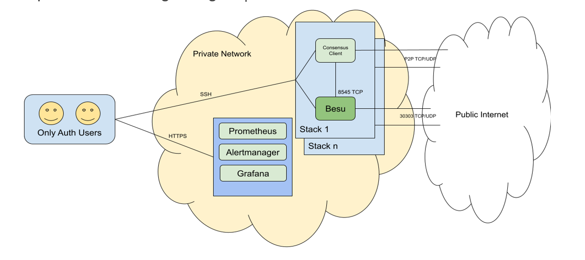

# Validator Nodes Recommendations for HL Besu’s Incentive Program

  

Below are high-level recommendations around set up of validator nodes to participate in the Incentive Program.

### Security Best Practices

Security needs to be the first priority when running validator nodes and funds need to be protected. A few recommended security best practices include:

- Restrict management access only to authorized users with MFA authentication and access auditing
- Alerting/Monitoring Nodes

### Hardware Recommendations

- CPU and Memory requirements
- Storage capacity requirements
- iOps responsiveness
- Network requirements

### Skills/People Recommendations

Need at least one 24/7 on call resource who is dedicated to monitoring each validator node. There responsibilities include:

1. Monitoring the alerts
2. Ensuring the nodes are ready for the hard forks
3. Ensure proposals aren’t missed

This resource should have experience in DevOps, Ethereum hard forking, cloud networks. 

### Costs to Consider

There are several costs to consider that are required upfront.

1. Hiring resources 
2. Cloud provider costs
3. Commercial licenses for monitoring, logging, and other production grade licenses

### Sample Network Design 

  

The above configuration in a cloud provider for **prater/goerli** for 2 validator nodes:

- Bastion - t2.micro
- Reporting/metrics - r5.large, 1gb EBS
- 2 Validator nodes  
t3a.large, storage: gp2, 500gb 1500 iops

Roughly 30% of the cost being storage, 60% of the cost being compute, and 10% network transfer.

  
**Mainnet** will require more compute resources, we currently use i3.xlarge for besu-only mainnet canary nodes.  Mainnet will also require more storage, recommended minimum 2Tb.  The monthly cost will increase over the goerli/prater configuration in accordance with the increased resource sizes (CPU and storage).

### Timeline

The program has already started for the majority of the Ethereum clients participating. To adequately prepare for the Merge, validator nodes need to be ready and participating in the pre-Merge activities. Today, by delaying participation in the program, we are missing out on roughly 17 eth (~$65k) per month in rewards. If we miss The Merge deadline, we will be missing substantially more in additional transaction fees, [projected to  be initially](https://docs.google.com/spreadsheets/d/1FslqTnECKvi7_l4x6lbyRhNtzW9f6CVEzwDf04zprfA/edit#gid=0) as high as ~96 eth/month. The Merge is scheduled for mid-2022.